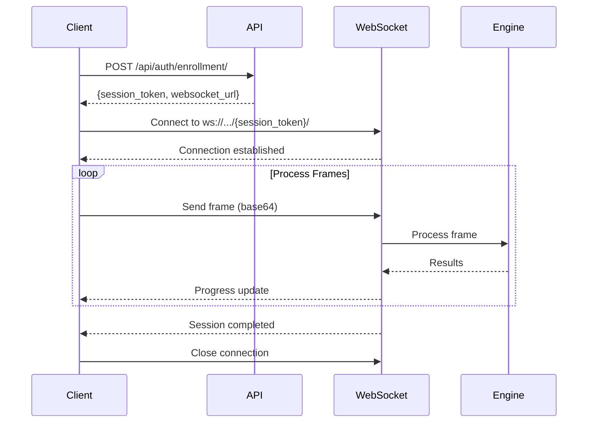

# Face Recognition Django Application

A comprehensive enterprise-grade Django application for real-time face recognition authentication with advanced liveness detection, obstacle detection, and anti-spoofing capabilities. Built for high-security applications requiring biometric authentication.

## 📋 Table of Contents

- [Features](#-features)
- [Technology Stack](#-technology-stack)
- [Architecture Overview](#️-architecture-overview)
- [Quick Start](#-quick-start)
- [API Documentation](#-api-documentation)
- [WebSocket Integration](#-websocket-integration)
- [Frontend Integration Guide](#-frontend-integration-guide)
- [Security Best Practices](#-security-best-practices)
- [Troubleshooting](#-troubleshooting)
- [Testing](#testing)
- [Production Deployment](#production-deployment)
- [Support & Documentation](#-support--documentation)

## ✨ Features

### Core Capabilities
- 🔐 **Real-time Face Authentication**: WebSocket-based real-time face recognition with sub-second response times
- 👁️ **Advanced Liveness Detection**: Multi-modal liveness verification using blink detection, motion analysis, and passive checks
- 🚫 **Obstacle Detection**: YOLOv8-powered detection to prevent masking and spoofing attempts
- 🎯 **InsightFace Integration**: State-of-the-art face recognition with 99.8%+ accuracy using Buffalo_L models
- 📊 **Vector Database**: ChromaDB and FAISS for efficient embedding storage and similarity search
- 🔄 **Dual Authentication Modes**: Support both REST API and WebSocket for different use cases

### Security & Compliance
- 🔒 **Multi-layer Encryption**: AES-256 encryption for sensitive data and embeddings
- 🔑 **Flexible Authentication**: API Key, JWT, and session-based authentication
- 🛡️ **Anti-spoofing**: Multiple layers of protection against photo, video, and mask attacks
- 📝 **Comprehensive Audit Logging**: Every authentication attempt tracked and logged
- 🚦 **Rate Limiting**: Configurable rate limits to prevent abuse
- 🔐 **CSRF Protection**: Full CSRF protection for web clients

### Enterprise Features
- 📈 **Analytics & Monitoring**: Real-time metrics, success rates, and performance tracking
- 🎛️ **Modern Admin Interface**: Django-unfold with custom dashboards and visualizations
- 🌊 **Background Processing**: Celery-based async task processing
- 🔄 **WebRTC Support**: Real-time video streaming for web applications
- 📱 **Multi-client Support**: Separate client management with isolated data
- 🌐 **Multi-region Ready**: Support for distributed deployments

### Developer Experience
- 📚 **API Documentation**: Auto-generated OpenAPI/Swagger documentation
- 🧪 **Comprehensive Testing**: Unit tests, integration tests, and load tests
- 🐳 **Docker Support**: Full containerization with docker-compose
- 📊 **Prometheus Metrics**: Production-ready monitoring integration
- 🔌 **Webhook Support**: Real-time event notifications

## 🔧 Technology Stack

### Backend Framework
- **Django 5.2.7**: Modern Python web framework
- **Django REST Framework**: RESTful API development
- **Django Channels**: WebSocket and async support
- **Celery 5.5**: Distributed task queue
- **Redis**: Cache, session storage, and message broker

### Face Recognition & AI
- **InsightFace**: Face detection and recognition (Buffalo_L model)
- **MediaPipe**: Facial landmark detection for liveness
- **OpenCV 4.11**: Image processing and computer vision
- **YOLOv8n**: Object detection for obstacle/spoofing detection
- **NumPy/SciPy**: Numerical computing and algorithms

### Database & Storage
- **PostgreSQL**: Primary database with pgvector extension
- **ChromaDB**: Vector database for face embeddings
- **FAISS**: Facebook AI Similarity Search (fallback)
- **MinIO/S3**: Object storage for images and media

### Real-time & Streaming
- **aiortc**: WebRTC implementation for Python
- **WebSockets**: Real-time bidirectional communication
- **STUN/TURN**: NAT traversal for WebRTC

### Security & Authentication
- **PyJWT**: JSON Web Token implementation
- **Cryptography**: AES-256 encryption
- **Argon2**: Password hashing
- **django-cors-headers**: CORS handling
- **django-ratelimit**: Rate limiting

### Monitoring & DevOps
- **django-prometheus**: Prometheus metrics
- **Sentry**: Error tracking and monitoring
- **Flower**: Celery monitoring
- **django-debug-toolbar**: Development debugging

## 🏗️ Architecture Overview

```
┌─────────────────┐
│   Frontend      │
│  (React/Vue)    │
└────────┬────────┘
         │
         ├─── HTTP/HTTPS ───┐
         │                   │
         └─── WebSocket ────┐│
                            ││
         ┌──────────────────┘│
         │                   │
┌────────▼────────┐ ┌────────▼────────┐
│   Nginx/LB      │ │   Daphne        │
│  (Port 80/443)  │ │  (ASGI Server)  │
└────────┬────────┘ └────────┬────────┘
         │                   │
         └─────────┬─────────┘
                   │
         ┌─────────▼─────────┐
         │  Django App       │
         │  - REST API       │
         │  - WebSocket      │
         │  - Admin Panel    │
         └─────────┬─────────┘
                   │
         ┌─────────┼─────────┐
         │         │         │
┌────────▼────┐ ┌──▼──────┐ ┌▼────────────┐
│ PostgreSQL  │ │  Redis  │ │  ChromaDB   │
│ (Primary DB)│ │ (Cache) │ │  (Vectors)  │
└─────────────┘ └────┬────┘ └─────────────┘
                     │
              ┌──────▼──────┐
              │   Celery    │
              │   Workers   │
              └─────────────┘
```

### Component Responsibilities

#### API Layer (`auth_service`, `core`)
- Client authentication (API Key, JWT)
- Enrollment and authentication session management
- Face processing pipeline orchestration
- WebSocket consumer handling

#### Face Recognition Engine (`core/face_recognition_engine.py`)
- Face detection using InsightFace
- Embedding extraction (512-d vectors)
- Similarity matching via ChromaDB
- Quality assessment

#### Liveness Detection (`core/passive_liveness_optimal.py`)
- Passive liveness checks
- Blink detection via MediaPipe
- Motion analysis
- Anti-spoofing validation

#### Session Management (`core/session_manager.py`)
- Redis-backed session storage
- Session expiration handling
- State management for multi-frame processing

#### Analytics (`analytics`)
- Authentication attempt logging
- Security event tracking
- Performance metrics aggregation
- Dashboard data preparation

## 🚀 Quick Start

### Prerequisites

Before you begin, ensure you have the following installed:

- **Python 3.11+** (recommended: 3.11 or 3.12)
- **PostgreSQL 14+** with pgvector extension
- **Redis 7.0+**
- **Git**
- **FFmpeg** (for video processing)
- **CMake** (for building InsightFace dependencies)

### 1. Environment Setup

```bash
# Clone the repository
git clone <repository-url>
cd face_recognition_app

# Create and activate virtual environment
python3.11 -m venv env
source env/bin/activate  # On Windows: env\Scripts\activate

# Upgrade pip
pip install --upgrade pip

# Install system dependencies (Ubuntu/Debian)
sudo apt-get update
sudo apt-get install -y \
    build-essential \
    cmake \
    libopencv-dev \
    python3-dev \
    libpq-dev \
    ffmpeg \
    libsm6 \
    libxext6

# Install Python dependencies
pip install -r requirements.txt

# Install InsightFace models (first time only)
python -c "import insightface; insightface.app.FaceAnalysis('buffalo_l')"
```

### 2. Environment Configuration

```bash
# Copy environment template
cp .env.example .env

# Edit .env file with your configurations
nano .env
```

### 3. Database Setup

```bash
# Install PostgreSQL with pgvector extension
# Ubuntu/Debian:
sudo apt-get install postgresql postgresql-contrib
sudo -u postgres psql
CREATE EXTENSION vector;

# Create database
createdb face_recognition_db

# Run migrations
python manage.py makemigrations
python manage.py migrate

# Create superuser
python manage.py createsuperuser
```

### 4. InsightFace Models Setup

```bash
# Download InsightFace models
mkdir -p models/insightface
cd models/insightface

# Download models (example - adjust URLs as needed)
wget https://github.com/deepinsight/insightface/releases/download/v0.7/buffalo_l.zip
unzip buffalo_l.zip
```

### 5. Redis Setup

```bash
# Install and start Redis
# Ubuntu/Debian:
sudo apt-get install redis-server
sudo systemctl start redis-server

# macOS:
brew install redis
brew services start redis
```

### 6. Start Services

```bash
# Terminal 1: Django development server
python manage.py runserver

# Terminal 2: Celery worker
celery -A face_app worker --loglevel=info

# Terminal 3: Celery beat (for scheduled tasks)
celery -A face_app beat --loglevel=info

# Terminal 4: ChromaDB (if using separate instance)
chroma run --host localhost --port 8000
```

## 📚 API Documentation

### Base URLs

- **Development**: `http://localhost:8000`
- **Production**: `https://your-domain.com`
- **API Swagger**: `/api/schema/swagger-ui/`
- **API ReDoc**: `/api/schema/redoc/`

### Authentication Methods

#### 1. Client API Key Authentication

Used by third-party clients to access the face recognition service:

```bash
POST /api/auth/client/
Content-Type: application/json

{
  "api_key": "your_client_api_key_here"
}
```

**Response:**

```json
{
  "jwt_token": "eyJhbGciOiJIUzI1NiIsInR5cCI6IkpXVCJ9...",
  "expires_at": "2025-11-26T10:00:00Z",
  "client_id": "uuid",
  "client_name": "Your Client Name"
}
```

#### 2. User JWT Authentication

For user-facing authentication:

```bash
POST /api/auth/token/
Content-Type: application/json

{
  "email": "user@example.com",
  "password": "SecurePassword123!",
  "device_info": {
    "device_id": "device-uuid",
    "device_name": "MacBook Pro",
    "device_type": "web",
    "os": "macOS",
    "browser": "Chrome"
  }
}
```

**Response:**

```json
{
  "access": "eyJhbGciOiJIUzI1NiIsInR5cCI6IkpXVCJ9...",
  "refresh": "eyJhbGciOiJIUzI1NiIsInR5cCI6IkpXVCJ9...",
  "user": {
    "id": "uuid",
    "email": "user@example.com",
    "full_name": "John Doe",
    "face_enrolled": true
  }
}
```

### Core Endpoints

#### Face Enrollment

##### Start Enrollment Session

```bash
POST /api/auth/enrollment/
Authorization: Bearer {JWT_TOKEN}
Content-Type: application/json

{
  "user_id": "external_user_id_123",
  "metadata": {
    "target_samples": 5,
    "enable_quality_check": true,
    "min_quality_score": 0.6
  }
}
```

**Response:**

```json
{
  "session_token": "session-uuid-here",
  "websocket_url": "wss://your-domain.com/ws/auth/process-image/session-uuid/",
  "expires_at": "2025-11-25T10:30:00Z",
  "status": "active",
  "config": {
    "target_samples": 5,
    "current_samples": 0,
    "require_liveness": true,
    "min_liveness_score": 0.7
  }
}
```

##### Process Enrollment Frame (REST API)

```bash
POST /api/auth/enrollment/process-frame/
Authorization: Bearer {JWT_TOKEN}
Content-Type: application/json

{
  "session_token": "session-uuid-here",
  "frame_data": "data:image/jpeg;base64,/9j/4AAQSkZJRgABAQAA..."
}
```

**Response:**

```json
{
  "success": true,
  "session_status": "in_progress",
  "completed_samples": 2,
  "target_samples": 5,
  "quality_score": 0.85,
  "face_detected": true,
  "liveness_data": {
    "blinks_detected": 1,
    "motion_score": 0.72,
    "liveness_passed": true
  },
  "obstacles": [],
  "message": "Frame processed successfully"
}
```

**Final Response (when completed):**

```json
{
  "success": true,
  "session_status": "completed",
  "completed_samples": 5,
  "target_samples": 5,
  "liveness_verified": true,
  "enrollment_id": "enrollment-uuid",
  "message": "Enrollment completed successfully"
}
```

#### Face Authentication

##### Start Authentication Session

```bash
POST /api/auth/authentication/
Authorization: Bearer {JWT_TOKEN}
Content-Type: application/json

{
  "user_id": "external_user_id_123",  // Optional for identification
  "require_liveness": true,
  "metadata": {
    "min_confidence": 0.85,
    "max_frames": 20,
    "timeout_seconds": 30
  }
}
```

**Response:**

```json
{
  "session_token": "auth-session-uuid",
  "websocket_url": "wss://your-domain.com/ws/auth/process-image/auth-session-uuid/",
  "expires_at": "2025-11-25T10:35:00Z",
  "status": "active",
  "config": {
    "require_liveness": true,
    "min_confidence": 0.85,
    "max_attempts": 3
  }
}
```

##### Process Authentication Frame (REST API)

```bash
POST /api/auth/authentication/process-frame/
Authorization: Bearer {JWT_TOKEN}
Content-Type: application/json

{
  "session_token": "auth-session-uuid",
  "frame_data": "data:image/jpeg;base64,/9j/4AAQSkZJRgABAQAA..."
}
```

**Success Response:**

```json
{
  "success": true,
  "authenticated": true,
  "confidence": 0.94,
  "user_id": "external_user_id_123",
  "liveness_passed": true,
  "processing_time_ms": 156,
  "matched_enrollment_id": "enrollment-uuid",
  "metadata": {
    "face_quality": 0.89,
    "liveness_score": 0.92
  }
}
```

**Failure Response:**

```json
{
  "success": false,
  "authenticated": false,
  "reason": "no_match_found",
  "confidence": 0.42,
  "message": "No matching face found in database"
}
```

#### Session Management

##### Get Session Status

```bash
GET /api/auth/session/{session_token}/status/
Authorization: Bearer {JWT_TOKEN}
```

**Response:**

```json
{
  "session_token": "session-uuid",
  "status": "in_progress",
  "session_type": "enrollment",
  "created_at": "2025-11-25T10:00:00Z",
  "expires_at": "2025-11-25T10:30:00Z",
  "progress": {
    "completed_samples": 3,
    "target_samples": 5,
    "liveness_checks_passed": 2
  },
  "last_activity": "2025-11-25T10:15:23Z"
}
```

##### Cancel Session

```bash
DELETE /api/auth/session/{session_token}/
Authorization: Bearer {JWT_TOKEN}
```

**Response:**

```json
{
  "success": true,
  "message": "Session cancelled successfully"
}
```

### User Management Endpoints

#### Register User

```bash
POST /api/auth/register/
Content-Type: application/json

{
  "email": "newuser@example.com",
  "password": "SecurePassword123!",
  "full_name": "Jane Doe",
  "phone_number": "+1234567890"
}
```

**Response:**

```json
{
  "message": "User registered successfully",
  "user_id": "user-uuid",
  "email": "newuser@example.com",
  "verification_required": true
}
```

#### Get User Profile

```bash
GET /api/auth/profile/
Authorization: Bearer {ACCESS_TOKEN}
```

**Response:**

```json
{
  "id": "user-uuid",
  "email": "user@example.com",
  "full_name": "John Doe",
  "face_enrolled": true,
  "enrollments": [
    {
      "id": "enrollment-uuid",
      "created_at": "2025-11-20T10:00:00Z",
      "quality_score": 0.92,
      "status": "active"
    }
  ],
  "last_authentication": "2025-11-25T09:00:00Z",
  "authentication_count": 42
}
```

#### Update User Profile

```bash
PUT /api/auth/profile/
Authorization: Bearer {ACCESS_TOKEN}
Content-Type: application/json

{
  "full_name": "John Smith",
  "phone_number": "+1234567890"
}
```

### Analytics Endpoints

#### Get Authentication Metrics

```bash
GET /api/analytics/authentication-metrics/
Authorization: Bearer {JWT_TOKEN}
Query Parameters:
  - start_date: 2025-11-01
  - end_date: 2025-11-25
  - client_id: uuid (optional)
```

**Response:**

```json
{
  "total_attempts": 1542,
  "successful_authentications": 1489,
  "failed_authentications": 53,
  "success_rate": 96.56,
  "average_response_time_ms": 187,
  "by_date": [
    {
      "date": "2025-11-25",
      "attempts": 156,
      "successes": 152,
      "failures": 4
    }
  ],
  "failure_reasons": {
    "no_match_found": 31,
    "liveness_failed": 15,
    "poor_quality": 7
  }
}
```

#### Get System Metrics

```bash
GET /api/analytics/system-metrics/
Authorization: Bearer {JWT_TOKEN}
```

**Response:**

```json
{
  "timestamp": "2025-11-25T10:00:00Z",
  "active_sessions": 12,
  "total_enrollments": 5234,
  "total_users": 4891,
  "chromadb_status": "healthy",
  "redis_status": "healthy",
  "celery_workers": 4,
  "average_processing_time_ms": 175,
  "requests_per_minute": 45
}
```

### Error Responses

All endpoints follow a consistent error response format:

```json
{
  "error": "error_code",
  "message": "Human-readable error message",
  "details": {
    "field": "Additional context about the error"
  },
  "timestamp": "2025-11-25T10:00:00Z"
}
```

#### Common Error Codes

| Status | Error Code | Description |
|--------|-----------|-------------|
| 400 | `invalid_request` | Malformed request or missing required fields |
| 401 | `unauthorized` | Invalid or expired authentication token |
| 403 | `forbidden` | Insufficient permissions for the operation |
| 404 | `not_found` | Requested resource does not exist |
| 409 | `conflict` | Resource already exists or state conflict |
| 422 | `validation_error` | Input validation failed |
| 429 | `rate_limit_exceeded` | Too many requests |
| 500 | `internal_error` | Server error |
| 503 | `service_unavailable` | Service temporarily unavailable |

### Rate Limits

| Endpoint Type | Limit | Window |
|--------------|-------|--------|
| Authentication | 100 requests | per hour |
| Enrollment | 20 sessions | per hour |
| Face Processing | 1000 frames | per minute |
| Analytics | 60 requests | per minute |

### Pagination

List endpoints support pagination:

```bash
GET /api/auth/enrollments/?page=1&page_size=20
```

**Response:**

```json
{
  "count": 234,
  "next": "https://api.example.com/api/auth/enrollments/?page=2",
  "previous": null,
  "results": [...]
}
```

## 🔌 WebSocket Integration

WebSocket provides a more efficient way to process multiple frames in real-time compared to REST API calls. It's recommended for production use cases requiring low latency and high throughput.

### WebSocket URL Format

```
wss://{domain}/ws/auth/process-image/{session_token}/
```

### Connection Flow



### JavaScript WebSocket Client

#### Basic Implementation

```javascript
class FaceRecognitionWebSocket {
  constructor(sessionToken, onMessage, onError) {
    this.sessionToken = sessionToken;
    this.ws = null;
    this.onMessage = onMessage;
    this.onError = onError;
    this.isConnected = false;
  }

  connect() {
    const wsUrl = `wss://your-domain.com/ws/auth/process-image/${this.sessionToken}/`;
    
    this.ws = new WebSocket(wsUrl);
    
    this.ws.onopen = () => {
      console.log('WebSocket connected');
      this.isConnected = true;
    };
    
    this.ws.onmessage = (event) => {
      try {
        const data = JSON.parse(event.data);
        this.onMessage(data);
      } catch (error) {
        console.error('Failed to parse message:', error);
      }
    };
    
    this.ws.onerror = (error) => {
      console.error('WebSocket error:', error);
      this.isConnected = false;
      if (this.onError) {
        this.onError(error);
      }
    };
    
    this.ws.onclose = () => {
      console.log('WebSocket disconnected');
      this.isConnected = false;
    };
  }

  sendFrame(frameData) {
    if (!this.isConnected || this.ws.readyState !== WebSocket.OPEN) {
      console.error('WebSocket is not connected');
      return false;
    }
    
    try {
      this.ws.send(JSON.stringify({
        type: 'process_frame',
        frame_data: frameData,
        timestamp: new Date().toISOString()
      }));
      return true;
    } catch (error) {
      console.error('Failed to send frame:', error);
      return false;
    }
  }

  disconnect() {
    if (this.ws) {
      this.ws.close();
      this.isConnected = false;
    }
  }
}
```

#### Usage Example - Enrollment

```javascript
// 1. Create enrollment session
async function startEnrollment(userId) {
  const response = await fetch('/api/auth/enrollment/', {
    method: 'POST',
    headers: {
      'Authorization': `Bearer ${jwtToken}`,
      'Content-Type': 'application/json'
    },
    body: JSON.stringify({
      user_id: userId,
      metadata: { target_samples: 5 }
    })
  });
  
  const data = await response.json();
  return data.session_token;
}

// 2. Setup WebSocket connection
const sessionToken = await startEnrollment('user123');

const ws = new FaceRecognitionWebSocket(
  sessionToken,
  handleMessage,
  handleError
);

ws.connect();

// 3. Handle messages
function handleMessage(data) {
  console.log('Received:', data);
  
  switch(data.type) {
    case 'enrollment_progress':
      updateProgressUI(data.completed_samples, data.target_samples);
      displayQualityScore(data.quality_score);
      displayLivenessStatus(data.liveness_data);
      break;
      
    case 'enrollment_complete':
      console.log('Enrollment completed!', data.enrollment_id);
      ws.disconnect();
      showSuccessMessage();
      break;
      
    case 'error':
      console.error('Error:', data.message);
      showErrorMessage(data.message);
      break;
      
    case 'liveness_instruction':
      displayInstruction(data.message); // e.g., "Please blink"
      break;
  }
}

function handleError(error) {
  console.error('WebSocket error:', error);
  showErrorMessage('Connection lost. Please try again.');
}

// 4. Capture and send frames
async function captureAndSendFrames() {
  const video = document.getElementById('video');
  const canvas = document.createElement('canvas');
  const ctx = canvas.getContext('2d');
  
  // Set canvas size to match video
  canvas.width = video.videoWidth;
  canvas.height = video.videoHeight;
  
  const intervalId = setInterval(() => {
    if (!ws.isConnected) {
      clearInterval(intervalId);
      return;
    }
    
    // Draw current video frame to canvas
    ctx.drawImage(video, 0, 0, canvas.width, canvas.height);
    
    // Convert to base64
    const frameData = canvas.toDataURL('image/jpeg', 0.8);
    
    // Send frame via WebSocket
    ws.sendFrame(frameData);
    
  }, 200); // Send frame every 200ms (5 FPS)
  
  return intervalId;
}
```

#### Usage Example - Authentication

```javascript
async function performAuthentication(userId) {
  // 1. Create authentication session
  const response = await fetch('/api/auth/authentication/', {
    method: 'POST',
    headers: {
      'Authorization': `Bearer ${jwtToken}`,
      'Content-Type': 'application/json'
    },
    body: JSON.stringify({
      user_id: userId,
      require_liveness: true
    })
  });
  
  const data = await response.json();
  const sessionToken = data.session_token;
  
  // 2. Setup WebSocket
  const ws = new FaceRecognitionWebSocket(
    sessionToken,
    handleAuthMessage,
    handleError
  );
  
  ws.connect();
  
  // 3. Handle authentication results
  function handleAuthMessage(data) {
    switch(data.type) {
      case 'authentication_result':
        if (data.authenticated) {
          console.log('Authentication successful!');
          console.log('Confidence:', data.confidence);
          console.log('User ID:', data.user_id);
          
          // Redirect to dashboard or handle success
          window.location.href = '/dashboard/';
        } else {
          console.log('Authentication failed:', data.reason);
          showErrorMessage('Face not recognized. Please try again.');
        }
        ws.disconnect();
        break;
        
      case 'processing':
        // Show processing indicator
        showSpinner();
        break;
        
      case 'error':
        showErrorMessage(data.message);
        ws.disconnect();
        break;
    }
  }
  
  // 4. Start capturing frames
  const intervalId = await captureAndSendFrames();
}
```

### WebSocket Message Types

#### Client to Server

```javascript
// Process Frame
{
  "type": "process_frame",
  "frame_data": "data:image/jpeg;base64,...",
  "timestamp": "2025-11-25T10:00:00Z"
}

// Ping (keep-alive)
{
  "type": "ping"
}

// Cancel Session
{
  "type": "cancel"
}
```

#### Server to Client

##### Enrollment Progress

```json
{
  "type": "enrollment_progress",
  "session_token": "uuid",
  "completed_samples": 3,
  "target_samples": 5,
  "quality_score": 0.87,
  "face_detected": true,
  "liveness_data": {
    "blinks_detected": 2,
    "motion_score": 0.78,
    "liveness_passed": true
  },
  "obstacles": [],
  "message": "Keep looking at the camera"
}
```

##### Enrollment Complete

```json
{
  "type": "enrollment_complete",
  "session_token": "uuid",
  "enrollment_id": "enrollment-uuid",
  "completed_samples": 5,
  "liveness_verified": true,
  "quality_score": 0.91,
  "message": "Enrollment completed successfully"
}
```

##### Authentication Result

```json
{
  "type": "authentication_result",
  "session_token": "uuid",
  "authenticated": true,
  "user_id": "external_user_id_123",
  "confidence": 0.96,
  "liveness_passed": true,
  "processing_time_ms": 142,
  "matched_enrollment_id": "enrollment-uuid"
}
```

##### Error Message

```json
{
  "type": "error",
  "error_code": "poor_image_quality",
  "message": "Image quality too low. Please ensure good lighting.",
  "details": {
    "quality_score": 0.32,
    "min_required": 0.60
  }
}
```

##### Liveness Instruction

```json
{
  "type": "liveness_instruction",
  "instruction": "please_blink",
  "message": "Please blink naturally",
  "timeout_seconds": 5
}
```

### Best Practices

#### Frame Rate and Quality

```javascript
// Optimal settings for enrollment
const ENROLLMENT_CONFIG = {
  frameRate: 5,           // 5 FPS (200ms interval)
  jpegQuality: 0.8,       // 80% quality
  maxWidth: 640,          // Max width in pixels
  maxHeight: 480          // Max height in pixels
};

// Optimal settings for authentication
const AUTH_CONFIG = {
  frameRate: 3,           // 3 FPS (333ms interval)
  jpegQuality: 0.8,
  maxWidth: 640,
  maxHeight: 480
};

function captureFrameOptimized(video, config) {
  const canvas = document.createElement('canvas');
  const ctx = canvas.getContext('2d');
  
  // Calculate scaled dimensions
  let width = video.videoWidth;
  let height = video.videoHeight;
  
  if (width > config.maxWidth) {
    height = (height * config.maxWidth) / width;
    width = config.maxWidth;
  }
  
  if (height > config.maxHeight) {
    width = (width * config.maxHeight) / height;
    height = config.maxHeight;
  }
  
  canvas.width = width;
  canvas.height = height;
  
  ctx.drawImage(video, 0, 0, width, height);
  
  return canvas.toDataURL('image/jpeg', config.jpegQuality);
}
```

#### Error Handling

```javascript
class RobustWebSocketClient {
  constructor(sessionToken, options = {}) {
    this.sessionToken = sessionToken;
    this.options = {
      maxReconnectAttempts: 3,
      reconnectDelay: 1000,
      pingInterval: 30000,
      ...options
    };
    this.reconnectAttempts = 0;
    this.pingTimer = null;
  }

  connect() {
    try {
      this.ws = new WebSocket(this.getWebSocketUrl());
      this.setupEventHandlers();
      this.startPingTimer();
    } catch (error) {
      this.handleConnectionError(error);
    }
  }

  setupEventHandlers() {
    this.ws.onopen = () => {
      console.log('Connected');
      this.reconnectAttempts = 0;
    };

    this.ws.onclose = (event) => {
      console.log('Disconnected:', event.code, event.reason);
      this.stopPingTimer();
      
      if (!event.wasClean && this.shouldReconnect()) {
        this.attemptReconnect();
      }
    };

    this.ws.onerror = (error) => {
      console.error('WebSocket error:', error);
    };

    this.ws.onmessage = (event) => {
      this.handleMessage(event.data);
    };
  }

  shouldReconnect() {
    return this.reconnectAttempts < this.options.maxReconnectAttempts;
  }

  attemptReconnect() {
    this.reconnectAttempts++;
    console.log(`Reconnecting... Attempt ${this.reconnectAttempts}`);
    
    setTimeout(() => {
      this.connect();
    }, this.options.reconnectDelay * this.reconnectAttempts);
  }

  startPingTimer() {
    this.pingTimer = setInterval(() => {
      if (this.ws && this.ws.readyState === WebSocket.OPEN) {
        this.ws.send(JSON.stringify({ type: 'ping' }));
      }
    }, this.options.pingInterval);
  }

  stopPingTimer() {
    if (this.pingTimer) {
      clearInterval(this.pingTimer);
      this.pingTimer = null;
    }
  }
}
```

#### Camera Access

```javascript
async function initializeCamera(constraints = {}) {
  const defaultConstraints = {
    video: {
      width: { ideal: 640 },
      height: { ideal: 480 },
      facingMode: 'user',
      frameRate: { ideal: 30 }
    },
    audio: false
  };

  const finalConstraints = {
    ...defaultConstraints,
    ...constraints
  };

  try {
    const stream = await navigator.mediaDevices.getUserMedia(finalConstraints);
    const video = document.getElementById('video');
    video.srcObject = stream;
    
    return new Promise((resolve, reject) => {
      video.onloadedmetadata = () => {
        video.play();
        resolve(stream);
      };
      video.onerror = reject;
    });
  } catch (error) {
    console.error('Camera access denied:', error);
    throw new Error('Unable to access camera. Please grant camera permissions.');
  }
}

function stopCamera(stream) {
  if (stream) {
    stream.getTracks().forEach(track => track.stop());
  }
}
```

### React Integration Example

```javascript
import { useEffect, useRef, useState } from 'react';

function useFaceRecognition(sessionToken) {
  const [status, setStatus] = useState('disconnected');
  const [progress, setProgress] = useState(null);
  const wsRef = useRef(null);

  useEffect(() => {
    if (!sessionToken) return;

    const ws = new FaceRecognitionWebSocket(
      sessionToken,
      handleMessage,
      handleError
    );

    ws.connect();
    wsRef.current = ws;

    return () => {
      ws.disconnect();
    };
  }, [sessionToken]);

  const handleMessage = (data) => {
    switch (data.type) {
      case 'enrollment_progress':
        setStatus('processing');
        setProgress(data);
        break;
      case 'enrollment_complete':
        setStatus('completed');
        break;
      case 'error':
        setStatus('error');
        break;
    }
  };

  const handleError = (error) => {
    setStatus('error');
    console.error(error);
  };

  const sendFrame = (frameData) => {
    return wsRef.current?.sendFrame(frameData);
  };

  return { status, progress, sendFrame };
}

// Usage in component
function EnrollmentComponent() {
  const [sessionToken, setSessionToken] = useState(null);
  const { status, progress, sendFrame } = useFaceRecognition(sessionToken);
  const videoRef = useRef(null);

  // ... rest of component
}
```

## Frontend Integration Guide

### 1. Camera Access and Frame Capture

```javascript
// Get camera access
async function initCamera() {
    const stream = await navigator.mediaDevices.getUserMedia({
        video: { 
            width: 640, 
            height: 480,
            facingMode: 'user'
        }
    });
    
    const video = document.getElementById('video');
    video.srcObject = stream;
    return stream;
}

// Capture frame from video
function captureFrame(video) {
    const canvas = document.createElement('canvas');
    canvas.width = video.videoWidth;
    canvas.height = video.videoHeight;
    
    const ctx = canvas.getContext('2d');
    ctx.drawImage(video, 0, 0);
    
    return canvas.toDataURL('image/jpeg', 0.8);
}
```

### 2. WebSocket Integration

```javascript
class FaceRecognitionClient {
    constructor(wsUrl) {
        this.ws = new WebSocket(wsUrl);
        this.setupEventHandlers();
    }
    
    setupEventHandlers() {
        this.ws.onmessage = (event) => {
            const data = JSON.parse(event.data);
            this.handleMessage(data);
        };
    }
    
    startEnrollment(userId) {
        this.ws.send(JSON.stringify({
            'type': 'start_enrollment',
            'user_id': userId
        }));
    }
    
    processFrame(frameData, sessionType) {
        this.ws.send(JSON.stringify({
            'type': 'process_frame',
            'frame_data': frameData,
            'session_type': sessionType
        }));
    }
    
    handleMessage(data) {
        switch(data.type) {
            case 'enrollment_progress':
                this.updateEnrollmentProgress(data.progress);
                break;
            case 'authentication_result':
                this.handleAuthResult(data.result);
                break;
            case 'liveness_check':
                this.handleLivenessCheck(data.status);
                break;
        }
    }
}
```

### 3. Complete Enrollment Flow

```javascript
async function performEnrollment(userId) {
    const client = new FaceRecognitionClient('ws://localhost:8000/ws/face-recognition/');
    const stream = await initCamera();
    const video = document.getElementById('video');
    
    client.startEnrollment(userId);
    
    // Capture frames at intervals
    const frameCapture = setInterval(() => {
        const frameData = captureFrame(video);
        client.processFrame(frameData, 'enrollment');
    }, 100); // 10 FPS
    
    // Stop after enrollment completion
    client.ws.onmessage = (event) => {
        const data = JSON.parse(event.data);
        if (data.type === 'enrollment_complete') {
            clearInterval(frameCapture);
            stream.getTracks().forEach(track => track.stop());
        }
    };
}
```

### 4. Authentication Flow

```javascript
async function performAuthentication() {
    const client = new FaceRecognitionClient('ws://localhost:8000/ws/face-recognition/');
    const stream = await initCamera();
    const video = document.getElementById('video');
    
    const frameCapture = setInterval(() => {
        const frameData = captureFrame(video);
        client.processFrame(frameData, 'authentication');
    }, 200); // 5 FPS for authentication
    
    client.ws.onmessage = (event) => {
        const data = JSON.parse(event.data);
        if (data.type === 'authentication_result') {
            if (data.result.success) {
                window.location.href = '/dashboard/';
            } else {
                showError('Authentication failed');
            }
            clearInterval(frameCapture);
            stream.getTracks().forEach(track => track.stop());
        }
    };
}
```

## Testing

### Run Tests
```bash
# Run all tests
python manage.py test

# Run specific test modules
python manage.py test core.tests
python manage.py test users.tests

# Run with coverage
coverage run --source='.' manage.py test
coverage report
```

### Test Registration Process
```python
from django.test import TestCase
from django.contrib.auth import get_user_model
from core.models import EnrollmentSession

User = get_user_model()

class RegistrationTestCase(TestCase):
    def test_user_registration(self):
        """Test user registration process"""
        response = self.client.post('/api/auth/register/', {
            'email': 'test@example.com',
            'password': 'testpassword123',
            'first_name': 'Test',
            'last_name': 'User'
        })
        self.assertEqual(response.status_code, 201)
        self.assertTrue(User.objects.filter(email='test@example.com').exists())
```

### Test Enrollment Process
```python
class EnrollmentTestCase(TestCase):
    def setUp(self):
        self.user = User.objects.create_user(
            email='test@example.com',
            password='testpassword123'
        )
    
    def test_enrollment_start(self):
        """Test enrollment session start"""
        self.client.force_authenticate(user=self.user)
        response = self.client.post('/api/core/enroll/start/')
        self.assertEqual(response.status_code, 201)
        
        session = EnrollmentSession.objects.get(user=self.user)
        self.assertEqual(session.status, 'in_progress')
```

## Security Considerations

1. **Data Encryption**: All face embeddings and personal data are encrypted
2. **Rate Limiting**: API endpoints have rate limiting to prevent abuse
3. **CORS Configuration**: Properly configured for production
4. **JWT Security**: Secure token handling with refresh mechanism
5. **Input Validation**: All inputs are validated and sanitized
6. **Audit Logging**: Comprehensive logging of all security events

## Production Deployment

### Docker Deployment
```dockerfile
# Dockerfile example
FROM python:3.11-slim

WORKDIR /app
COPY requirements.txt .
RUN pip install -r requirements.txt

COPY . .
EXPOSE 8000

CMD ["gunicorn", "face_app.wsgi:application", "--bind", "0.0.0.0:8000"]
```

### Environment Variables (Production)
```bash
DEBUG=False
ALLOWED_HOSTS=yourdomain.com,www.yourdomain.com
SECURE_SSL_REDIRECT=True
SECURE_HSTS_SECONDS=31536000
```

## Monitoring and Maintenance

- **Health Checks**: `/health/` endpoint for monitoring
- **Metrics**: Prometheus-compatible metrics at `/metrics/`
- **Admin Interface**: Comprehensive admin at `/admin/`
- **Logs**: Structured logging with rotation
- **Celery Monitoring**: Use Flower for Celery task monitoring

## 🔒 Security Best Practices

### Data Encryption

#### Face Embeddings Encryption

All face embeddings are encrypted at rest using AES-256:

```python
# Embeddings are automatically encrypted when stored
# Configure encryption key in .env
FIELD_ENCRYPTION_KEY="your-32-byte-base64-encoded-key"
```

To generate a new encryption key:

```bash
python -c "from cryptography.fernet import Fernet; print(Fernet.generate_key().decode())"
```

#### Secure Configuration

```bash
# Production .env configuration
DEBUG=False
SECRET_KEY="your-long-random-secret-key"
FIELD_ENCRYPTION_KEY="your-encryption-key"

# Database encryption
DB_SSL_MODE=require

# HTTPS enforcement
SECURE_SSL_REDIRECT=True
SECURE_HSTS_SECONDS=31536000
SECURE_HSTS_INCLUDE_SUBDOMAINS=True
SECURE_HSTS_PRELOAD=True

# Cookie security
SESSION_COOKIE_SECURE=True
CSRF_COOKIE_SECURE=True
CSRF_COOKIE_HTTPONLY=True
CSRF_COOKIE_SAMESITE='Strict'
```

### Authentication Security

#### API Key Management

- Store API keys in environment variables or secure vaults (AWS Secrets Manager, HashiCorp Vault)
- Rotate API keys regularly (every 90 days)
- Use different API keys for different environments
- Never commit API keys to version control

```python
# Good: Environment variable
API_KEY = os.getenv('CLIENT_API_KEY')

# Bad: Hard-coded
API_KEY = "sk-1234567890abcdef"  # Never do this!
```

#### JWT Token Security

```python
# JWT Configuration
SIMPLE_JWT = {
    'ACCESS_TOKEN_LIFETIME': timedelta(minutes=15),
    'REFRESH_TOKEN_LIFETIME': timedelta(days=7),
    'ROTATE_REFRESH_TOKENS': True,
    'BLACKLIST_AFTER_ROTATION': True,
    'ALGORITHM': 'HS256',
    'SIGNING_KEY': settings.SECRET_KEY,
    'AUTH_HEADER_TYPES': ('Bearer',),
}
```

### Rate Limiting

```python
# settings.py
RATELIMIT_ENABLE = True
RATELIMIT_USE_CACHE = 'default'

# Per-view rate limiting
from django_ratelimit.decorators import ratelimit

@ratelimit(key='ip', rate='100/h', method='POST')
def enrollment_view(request):
    # Protected by rate limiting
    pass
```

### Input Validation

All inputs are validated using Django REST Framework serializers:

```python
class EnrollmentRequestSerializer(serializers.Serializer):
    user_id = serializers.CharField(max_length=255, required=True)
    frame_data = serializers.CharField(required=True)
    
    def validate_frame_data(self, value):
        # Validate base64 image format
        if not value.startswith('data:image/'):
            raise serializers.ValidationError("Invalid image format")
        return value
```

### CORS Configuration

```python
# settings.py
CORS_ALLOWED_ORIGINS = [
    "https://your-frontend.com",
    "https://app.your-domain.com",
]

CORS_ALLOW_CREDENTIALS = True
CORS_ALLOW_HEADERS = list(default_headers) + [
    'x-client-id',
    'x-request-id',
]
```

### Security Headers

```python
# settings.py
SECURE_BROWSER_XSS_FILTER = True
SECURE_CONTENT_TYPE_NOSNIFF = True
X_FRAME_OPTIONS = 'DENY'

# Content Security Policy
CSP_DEFAULT_SRC = ("'self'",)
CSP_SCRIPT_SRC = ("'self'", "'unsafe-inline'")
CSP_STYLE_SRC = ("'self'", "'unsafe-inline'")
```

### Audit Logging

All security-relevant events are logged:

```python
# Automatically logged events:
- Authentication attempts (success/failure)
- Enrollment activities
- API key usage
- Rate limit violations
- Security policy violations
- Admin access

# View logs
tail -f logs/security.log
```

### Anti-Spoofing Measures

1. **Passive Liveness Detection**: Analyzes image characteristics
2. **Active Liveness Detection**: Blink and motion detection
3. **Obstacle Detection**: YOLOv8 detects masks, photos, screens
4. **Quality Checks**: Ensures genuine, high-quality captures
5. **Multi-frame Analysis**: Temporal consistency checks

## 🔧 Troubleshooting

### Common Issues

#### 1. ChromaDB Connection Issues

**Error**: `ConnectionError: Cannot connect to ChromaDB`

**Solution**:

```bash
# Check if ChromaDB is running
ps aux | grep chroma

# Restart ChromaDB
pkill -f chroma
python -c "import chromadb; chromadb.Client()"

# Check ChromaDB data directory
ls -la ./chroma/
```

#### 2. InsightFace Model Loading Failure

**Error**: `Model buffalo_l not found`

**Solution**:

```bash
# Reinstall InsightFace
pip uninstall insightface -y
pip install insightface==0.7.3

# Download models manually
python << EOF
import insightface
from insightface.app import FaceAnalysis
app = FaceAnalysis(name='buffalo_l', providers=['CPUExecutionProvider'])
app.prepare(ctx_id=0, det_size=(640, 640))
print("Models downloaded successfully")
EOF
```

#### 3. Redis Connection Error

**Error**: `redis.exceptions.ConnectionError: Error 111 connecting to localhost:6379`

**Solution**:

```bash
# Check Redis status
redis-cli ping

# If not installed
brew install redis  # macOS
sudo apt-get install redis-server  # Ubuntu

# Start Redis
redis-server

# Check Redis connection from Python
python -c "import redis; r = redis.Redis(host='localhost', port=6379); print(r.ping())"
```

#### 4. Database Migration Issues

**Error**: `django.db.migrations.exceptions.InconsistentMigrationHistory`

**Solution**:

```bash
# Show current migrations
python manage.py showmigrations

# Fake migrations if necessary (use with caution)
python manage.py migrate --fake app_name migration_name

# Or reset migrations (development only)
python manage.py migrate --fake app_name zero
python manage.py migrate app_name
```

#### 5. WebSocket Connection Refused

**Error**: `WebSocket connection failed: Connection refused`

**Solution**:

```bash
# Check if Daphne is running
ps aux | grep daphne

# Check ASGI configuration
python manage.py runserver  # Development
# or
daphne -b 0.0.0.0 -p 8000 face_app.asgi:application  # Production

# Check Channels configuration
python manage.py shell
>>> from channels.layers import get_channel_layer
>>> channel_layer = get_channel_layer()
>>> import asyncio
>>> asyncio.run(channel_layer.send('test', {'type': 'test.message'}))
```

#### 6. Poor Face Recognition Accuracy

**Symptoms**: Low confidence scores, false rejections

**Solutions**:

```python
# Adjust confidence threshold in settings
FACE_RECOGNITION_THRESHOLD = 0.6  # Lower for less strict (default: 0.65)

# Improve image quality:
# - Ensure good lighting
# - Use higher resolution camera (720p+)
# - Reduce image compression
# - Clean camera lens

# Re-enroll users with better quality images
# Check enrollment quality scores:
python manage.py shell
>>> from auth_service.models import FaceEnrollment
>>> enrollments = FaceEnrollment.objects.filter(quality_score__lt=0.7)
>>> print(f"Low quality enrollments: {enrollments.count()}")
```

#### 7. Liveness Detection Failing

**Error**: `Liveness check failed`

**Solutions**:

```bash
# Check MediaPipe installation
python -c "import mediapipe as mp; print(mp.__version__)"

# Adjust liveness sensitivity in settings.py
LIVENESS_MIN_BLINKS = 1  # Reduce from 2
LIVENESS_MOTION_THRESHOLD = 0.5  # Lower threshold
PASSIVE_LIVENESS_THRESHOLD = 0.6  # Adjust threshold

# Test liveness detection
python manage.py shell
>>> from core.passive_liveness_optimal import OptimizedPassiveLivenessDetector
>>> detector = OptimizedPassiveLivenessDetector()
>>> # Test with sample image
```

#### 8. High Memory Usage

**Symptoms**: Server OOM errors, slow response times

**Solutions**:

```bash
# Monitor memory usage
htop
# or
docker stats  # if using Docker

# Reduce model memory footprint
# In settings.py:
INSIGHTFACE_DET_SIZE = (320, 320)  # Smaller detection size
FACE_RECOGNITION_BATCH_SIZE = 1    # Process one at a time

# Limit Celery worker memory
celery -A face_app worker --max-memory-per-child=500000  # 500MB

# Enable memory profiling
pip install memory_profiler
python -m memory_profiler manage.py runserver
```

#### 9. Celery Tasks Not Running

**Error**: Tasks remain in PENDING state

**Solution**:

```bash
# Check Celery worker status
celery -A face_app inspect active
celery -A face_app inspect stats

# Check Redis connection
redis-cli
> KEYS celery*

# Restart Celery worker with increased verbosity
celery -A face_app worker --loglevel=debug

# Check task routing
python manage.py shell
>>> from face_app import celery_app
>>> celery_app.conf.task_routes
```

#### 10. Docker Container Issues

**Error**: Container exits immediately

**Solution**:

```bash
# Check container logs
docker-compose logs -f app

# Check container status
docker-compose ps

# Rebuild containers
docker-compose down -v
docker-compose build --no-cache
docker-compose up

# Enter container for debugging
docker-compose exec app /bin/bash
```

### Performance Optimization

#### Database Query Optimization

```python
# Use select_related and prefetch_related
enrollments = FaceEnrollment.objects.select_related(
    'user', 'client'
).prefetch_related('authentication_logs')

# Add database indexes
class FaceEnrollment(models.Model):
    class Meta:
        indexes = [
            models.Index(fields=['user', 'status']),
            models.Index(fields=['created_at']),
        ]
```

#### Redis Caching

```python
from django.core.cache import cache

# Cache face embeddings lookup
def get_user_embeddings(user_id):
    cache_key = f'embeddings:{user_id}'
    embeddings = cache.get(cache_key)
    
    if embeddings is None:
        embeddings = fetch_embeddings_from_db(user_id)
        cache.set(cache_key, embeddings, timeout=3600)  # 1 hour
    
    return embeddings
```

#### ChromaDB Optimization

```python
# Batch insert embeddings
embeddings_batch = []
for enrollment in enrollments:
    embeddings_batch.append({
        'embedding': enrollment.embedding,
        'metadata': {'user_id': enrollment.user_id}
    })

collection.add(
    embeddings=[e['embedding'] for e in embeddings_batch],
    metadatas=[e['metadata'] for e in embeddings_batch],
    ids=[f"user_{i}" for i in range(len(embeddings_batch))]
)
```

### Debugging Tools

#### Enable Debug Logging

```python
# settings.py
LOGGING = {
    'version': 1,
    'disable_existing_loggers': False,
    'handlers': {
        'file': {
            'level': 'DEBUG',
            'class': 'logging.FileHandler',
            'filename': 'debug.log',
        },
    },
    'loggers': {
        'auth_service': {
            'handlers': ['file'],
            'level': 'DEBUG',
        },
        'core': {
            'handlers': ['file'],
            'level': 'DEBUG',
        },
    },
}
```

#### Django Debug Toolbar

```bash
# Already installed in requirements.txt
# Access at: http://localhost:8000/__debug__/
```

#### API Testing with cURL

```bash
# Test enrollment endpoint
curl -X POST http://localhost:8000/api/auth/enrollment/ \
  -H "Authorization: Bearer YOUR_JWT_TOKEN" \
  -H "Content-Type: application/json" \
  -d '{
    "user_id": "test_user_123",
    "metadata": {"target_samples": 3}
  }' | jq

# Test authentication
curl -X POST http://localhost:8000/api/auth/authentication/ \
  -H "Authorization: Bearer YOUR_JWT_TOKEN" \
  -H "Content-Type: application/json" \
  -d '{
    "user_id": "test_user_123",
    "require_liveness": true
  }' | jq
```

### Health Checks

```bash
# Check system health
curl http://localhost:8000/health/ | jq

# Expected response:
{
  "status": "healthy",
  "timestamp": "2025-11-25T10:00:00Z",
  "services": {
    "database": "up",
    "redis": "up",
    "chromadb": "up",
    "celery": "up"
  }
}
```

### Monitoring Commands

```bash
# Watch logs in real-time
tail -f logs/app.log logs/error.log logs/security.log

# Monitor Celery
watch -n 2 'celery -A face_app inspect active'

# Monitor Redis
redis-cli monitor

# Monitor PostgreSQL
psql -h localhost -U postgres face_recognition_db \
  -c "SELECT * FROM pg_stat_activity WHERE datname='face_recognition_db';"
```

## 📞 Support & Documentation

### Additional Resources

- **API Documentation**: `/api/schema/swagger-ui/`
- **Admin Panel**: `/admin/`
- **WebSocket Guide**: `auth_service/WEBSOCKET_GUIDE.md`
- **Authentication Guide**: `docs/authentication.md`
- **Enrollment Guide**: `docs/enrollment.md`

### Getting Help

For issues and questions:

1. Check this README and additional documentation in `/docs`
2. Review the logs in `logs/` directory
3. Monitor the admin interface for system status
4. Check Celery task queue status
5. Review Sentry for error tracking (if configured)

### Contributing

Contributions are welcome! Please:

1. Fork the repository
2. Create a feature branch
3. Make your changes with tests
4. Submit a pull request

### License

[Your License Here]
