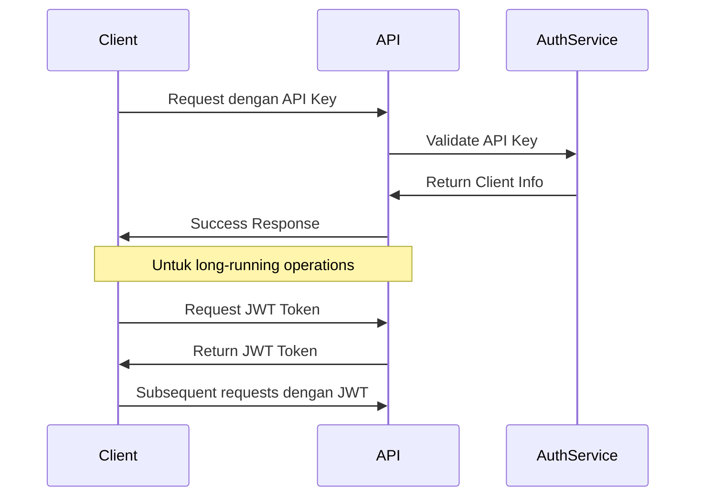

# Face Recognition API - Panduan Integrasi

## Daftar Isi

1. [Pengantar](#pengantar)
2. [Quick Start](#quick-start)
3. [Authentication](#authentication)
4. [Core Workflows](#core-workflows)
5. [API Endpoint Reference](#api-endpoint-reference)
6. [WebSocket Integration](#websocket-integration)
7. [Error Handling](#error-handling)
8. [Rate Limiting](#rate-limiting)
9. [Webhook Integration](#webhook-integration)
10. [SDK dan Code Examples](#sdk-dan-code-examples)

---

## Pengantar

Face Recognition API adalah platform enterprise-grade yang menyediakan layanan face recognition, liveness detection, dan anti-spoofing melalui REST API yang mudah diintegrasikan. API ini dirancang untuk mendukung berbagai use case mulai dari authentication hingga access control.

### Key Features

- **Multi-Modal Recognition**: Verification (1:1) dan Identification (1:N)
- **Liveness Detection**: Deteksi kehidupan real-time untuk mencegah spoofing
- **WebRTC Support**: Real-time video processing dan streaming
- **Multi-Tenancy**: Isolasi data dan resource per client
- **Analytics & Monitoring**: Comprehensive reporting dan monitoring
- **Webhook Integration**: Event-driven notifications
- **High Performance**: Sub-second response times

### API Base URL

```
Production: https://api.facerecognition.com
Staging: https://staging-api.facerecognition.com
Development: http://localhost:8000/api
```

### API Version

Current Version: **v1**
All endpoints prefixed with `/api/`

---

## Quick Start

### 1. Registrasi Account

Hubungi tim sales untuk mendapatkan:
- `api_key`: Unique identifier untuk aplikasi Anda
- `secret_key`: Secret untuk signing dan verification
- `client_id`: Tenant identifier

### 2. Basic Authentication Test

```bash
curl -X GET "https://api.facerecognition.com/api/core/status/" \
  -H "Authorization: ApiKey YOUR_API_KEY:YOUR_SECRET_KEY"
```

### 3. First Face Enrollment

```bash
# Step 1: Create enrollment session
curl -X POST "https://api.facerecognition.com/api/auth/enrollment/create/" \
  -H "Authorization: ApiKey YOUR_API_KEY:YOUR_SECRET_KEY" \
  -H "Content-Type: application/json" \
  -d '{
    "user_id": "user123",
    "session_type": "webcam"
  }'

# Step 2: Upload face image
curl -X POST "https://api.facerecognition.com/api/auth/enrollment/process-frame/" \
  -H "Authorization: ApiKey YOUR_API_KEY:YOUR_SECRET_KEY" \
  -H "X-Session-Token: SESSION_TOKEN_FROM_STEP1" \
  -F "frame=@face_image.jpg"

# Step 3: Complete enrollment  
curl -X POST "https://api.facerecognition.com/api/auth/enrollment/complete/" \
  -H "Authorization: ApiKey YOUR_API_KEY:YOUR_SECRET_KEY" \
  -H "X-Session-Token: SESSION_TOKEN_FROM_STEP1"
```

### 4. First Authentication

```bash
# Step 1: Create authentication session
curl -X POST "https://api.facerecognition.com/api/auth/authentication/create/" \
  -H "Authorization: ApiKey YOUR_API_KEY:YOUR_SECRET_KEY" \
  -H "Content-Type: application/json" \
  -d '{
    "session_type": "webcam",
    "require_liveness": true,
    "mode": "verification",
    "user_id": "user123"
  }'

# Step 2: Process authentication frame
curl -X POST "https://api.facerecognition.com/api/auth/authentication/process-frame/" \
  -H "Authorization: ApiKey YOUR_API_KEY:YOUR_SECRET_KEY" \
  -H "X-Session-Token: SESSION_TOKEN_FROM_STEP1" \
  -F "frame=@auth_image.jpg"
```

---

## Authentication

### Authentication Methods

#### 1. API Key Authentication (Recommended)

```http
Authorization: ApiKey {api_key}:{secret_key}
```

**Example:**
```bash
curl -H "Authorization: ApiKey abc123def456:xyz789secret"
```

#### 2. JWT Authentication

```http
Authorization: Bearer {jwt_token}
```

**Getting JWT Token:**
```bash
curl -X POST "/api/auth/client-token/" \
  -H "Authorization: ApiKey YOUR_API_KEY:YOUR_SECRET_KEY"
```

#### 3. Session Token (Temporary)

```http
X-Session-Token: {session_token}
```

Used for specific operations within enrollment/authentication sessions.

### Authentication Flow



### Security Best Practices

1. **Never expose secret keys** di client-side code
2. **Use HTTPS** untuk semua API calls
3. **Implement proper key rotation** secara berkala
4. **Store credentials securely** menggunakan environment variables
5. **Monitor API usage** untuk deteksi anomali

---

## Core Workflows

### 1. User Management

#### Create User

```bash
curl -X POST "/api/clients/users/" \
  -H "Authorization: ApiKey YOUR_API_KEY:YOUR_SECRET_KEY" \
  -H "Content-Type: application/json" \
  -d '{
    "external_id": "user123",
    "name": "John Doe",
    "email": "john@example.com",
    "metadata": {
      "department": "engineering",
      "employee_id": "EMP001"
    }
  }'
```

#### List Users

```bash
curl -X GET "/api/clients/users/?page=1&page_size=20" \
  -H "Authorization: ApiKey YOUR_API_KEY:YOUR_SECRET_KEY"
```

#### Get User Details

```bash
curl -X GET "/api/clients/users/USER_UUID/" \
  -H "Authorization: ApiKey YOUR_API_KEY:YOUR_SECRET_KEY"
```

### 2. Face Enrollment Workflow

#### Session-based Enrollment

```python
# Step 1: Create enrollment session
POST /api/auth/enrollment/create/
{
    "user_id": "user123",
    "session_type": "webcam",  # or "mobile", "upload"
    "quality_threshold": 0.8,
    "require_multiple_angles": true,
    "timeout": 300  # seconds
}

# Response
{
    "session_token": "sess_abc123",
    "session_id": "uuid",
    "expires_at": "2024-01-01T12:00:00Z",
    "instructions": {
        "message": "Please look directly at the camera",
        "requirements": ["front_facing", "good_lighting"]
    }
}
```

```python
# Step 2: Process frames (multiple calls)
POST /api/auth/enrollment/process-frame/
Headers: X-Session-Token: sess_abc123
Content-Type: multipart/form-data

frame: <binary_image_data>
frame_metadata: {
    "timestamp": "2024-01-01T12:00:01Z",
    "device_orientation": "portrait",
    "lighting_conditions": "good"
}

# Response  
{
    "status": "processing",
    "quality_score": 0.85,
    "feedback": {
        "message": "Good quality. Try moving slightly to the left.",
        "suggestions": ["adjust_angle"]
    },
    "progress": {
        "current": 2,
        "required": 3
    }
}
```

```python
# Step 3: Complete enrollment
POST /api/auth/enrollment/complete/
Headers: X-Session-Token: sess_abc123

# Response
{
    "status": "completed",
    "enrollment_id": "uuid",
    "user_id": "user123", 
    "quality_metrics": {
        "overall_quality": 0.92,
        "face_count": 3,
        "average_confidence": 0.94
    },
    "created_at": "2024-01-01T12:05:00Z"
}
```

#### Direct Upload Enrollment

```bash
curl -X POST "/api/auth/enrollment/direct/" \
  -H "Authorization: ApiKey YOUR_API_KEY:YOUR_SECRET_KEY" \
  -F "user_id=user123" \
  -F "image=@face_photo.jpg" \
  -F "quality_threshold=0.8"
```

### 3. Face Authentication Workflow

#### Verification (1:1)

```python
# Step 1: Create verification session
POST /api/auth/authentication/create/
{
    "user_id": "user123",  # Specific user to verify against
    "session_type": "webcam",
    "mode": "verification",
    "require_liveness": true,
    "liveness_threshold": 0.7,
    "timeout": 60
}

# Step 2: Process authentication frame
POST /api/auth/authentication/process-frame/
Headers: X-Session-Token: {session_token}

# Response
{
    "status": "completed",
    "result": {
        "authenticated": true,
        "confidence": 0.94,
        "user_id": "user123",
        "liveness_score": 0.89
    },
    "processing_time": 0.234
}
```

#### Identification (1:N)

```python  
# Step 1: Create identification session
POST /api/auth/authentication/create/
{
    "session_type": "webcam",
    "mode": "identification", 
    "require_liveness": true,
    "search_threshold": 0.8,
    "max_results": 5
}

# Response includes potential matches
{
    "status": "completed",
    "result": {
        "matches": [
            {
                "user_id": "user123",
                "confidence": 0.94,
                "name": "John Doe"
            },
            {
                "user_id": "user456", 
                "confidence": 0.87,
                "name": "Jane Smith"
            }
        ],
        "liveness_score": 0.91
    }
}
```

### 4. Real-time Streaming

#### WebRTC Session Setup

```javascript
// Step 1: Create WebRTC session
const response = await fetch('/api/streaming/sessions/', {
    method: 'POST',
    headers: {
        'Authorization': 'ApiKey YOUR_API_KEY:YOUR_SECRET_KEY',
        'Content-Type': 'application/json'
    },
    body: JSON.stringify({
        session_type: 'webrtc',
        mode: 'verification',
        user_id: 'user123'
    })
});

const session = await response.json();

// Step 2: Setup WebRTC connection
const peerConnection = new RTCPeerConnection({
    iceServers: session.ice_servers
});

// Step 3: Handle signaling
const ws = new WebSocket(session.signaling_url);
ws.onmessage = (event) => {
    const message = JSON.parse(event.data);
    // Handle offer/answer/ice candidates
};
```

---

## API Endpoint Reference

### Core System

#### Health Check
```http
GET /api/core/status/
```
System health dan availability check.

#### System Configuration
```http
GET /api/core/config/
GET /api/core/config/{id}/
```
Retrieve system configuration settings.

### Client Management

#### Client Users
```http
GET /api/clients/users/                    # List users
POST /api/clients/users/                   # Create user
GET /api/clients/users/{id}/               # Get user details  
PUT /api/clients/users/{id}/               # Update user
DELETE /api/clients/users/{id}/            # Delete user
POST /api/clients/users/{id}/activate/     # Activate user
POST /api/clients/users/{id}/deactivate/   # Deactivate user
```

#### Client Statistics
```http
GET /api/clients/statistics/               # Usage statistics
GET /api/clients/api-usage/                # API usage metrics
GET /api/clients/api-usage/{id}/           # Specific usage details
```

### Authentication Service

#### Enrollment Endpoints
```http
POST /api/auth/enrollment/create/          # Create enrollment session
POST /api/auth/enrollment/process-frame/   # Process enrollment frame
POST /api/auth/enrollment/complete/        # Complete enrollment
POST /api/auth/enrollment/direct/          # Direct image upload
GET /api/auth/enrollment/{id}/             # Get enrollment details
```

#### Authentication Endpoints
```http
POST /api/auth/authentication/create/      # Create auth session
POST /api/auth/authentication/process-frame/ # Process auth frame
GET /api/auth/authentication/{id}/         # Get auth session details
```

#### Token Management
```http
POST /api/auth/client-token/               # Get JWT token
POST /api/auth/refresh-token/              # Refresh JWT token
```

### Recognition (Legacy - Deprecated)

#### Face Embeddings
```http
GET /api/recognition/embeddings/           # List embeddings
GET /api/recognition/embeddings/{id}/      # Get embedding details
```

#### Sessions & Attempts  
```http
GET /api/recognition/sessions/             # List sessions
GET /api/recognition/sessions/{id}/        # Get session details
GET /api/recognition/attempts/             # List attempts
GET /api/recognition/attempts/{id}/        # Get attempt details
```

### Streaming Service

#### Session Management
```http
POST /api/streaming/sessions/              # Create streaming session
GET /api/streaming/sessions/{id}/          # Get session details
POST /api/streaming/sessions/{id}/close/   # Close session
```

#### WebRTC Signaling
```http
POST /api/streaming/webrtc/offer/          # Send WebRTC offer
POST /api/streaming/webrtc/answer/         # Send WebRTC answer
POST /api/streaming/webrtc/ice/            # Send ICE candidate
```

### Analytics

#### Usage Analytics
```http
GET /api/analytics/dashboard/              # Analytics dashboard
GET /api/analytics/statistics/             # Usage statistics
GET /api/analytics/user-behavior/          # User behavior analytics
GET /api/analytics/face-recognition-stats/ # Recognition statistics
```

#### System Monitoring
```http
GET /api/analytics/system-metrics/         # System performance metrics
GET /api/analytics/audit-logs/             # Audit trail logs
GET /api/analytics/security-events/        # Security event logs
GET /api/analytics/model-performance/      # ML model performance
```

#### Reporting
```http
GET /api/analytics/api/daily/              # Daily API usage report
GET /api/analytics/api/summary/            # API usage summary
GET /api/analytics/api/overview/           # Multi-period overview
```

### Webhook Management

#### Webhook Endpoints
```http
GET /api/webhooks/endpoints/               # List webhook endpoints
POST /api/webhooks/endpoints/              # Create webhook endpoint
PUT /api/webhooks/endpoints/{id}/          # Update webhook endpoint
DELETE /api/webhooks/endpoints/{id}/       # Delete webhook endpoint
```

#### Webhook Events & Logs
```http
GET /api/webhooks/events/                  # List webhook events
GET /api/webhooks/events/{id}/             # Get event details
GET /api/webhooks/logs/                    # Delivery logs
GET /api/webhooks/logs/{id}/               # Specific delivery log
```

---

## WebSocket Integration

### Connection Setup

```javascript
// Connect to WebSocket
const ws = new WebSocket('wss://api.facerecognition.com/ws/recognition/');

// Authentication
ws.onopen = () => {
    ws.send(JSON.stringify({
        type: 'authenticate',
        token: 'YOUR_SESSION_TOKEN'
    }));
};

// Handle messages
ws.onmessage = (event) => {
    const data = JSON.parse(event.data);
    
    switch(data.type) {
        case 'recognition_result':
            handleRecognitionResult(data.payload);
            break;
        case 'liveness_update':
            updateLivenessIndicator(data.payload);
            break;
        case 'session_status':
            updateSessionStatus(data.payload);
            break;
    }
};
```

### Real-time Frame Processing

```javascript
// Send video frame for processing
function processVideoFrame(videoElement) {
    const canvas = document.createElement('canvas');
    const ctx = canvas.getContext('2d');
    
    canvas.width = videoElement.videoWidth;
    canvas.height = videoElement.videoHeight;
    ctx.drawImage(videoElement, 0, 0);
    
    // Convert to base64
    const frameData = canvas.toDataURL('image/jpeg', 0.8);
    
    // Send via WebSocket
    ws.send(JSON.stringify({
        type: 'process_frame',
        frame: frameData,
        timestamp: Date.now()
    }));
}

// Process frames at 30 FPS
setInterval(() => {
    if (ws.readyState === WebSocket.OPEN) {
        processVideoFrame(videoElement);
    }
}, 33); // ~30 FPS
```

### Event Types

#### Recognition Events
```json
{
    "type": "recognition_result",
    "payload": {
        "status": "success",
        "confidence": 0.94,
        "user_id": "user123",
        "processing_time": 0.156
    }
}
```

#### Liveness Events
```json
{
    "type": "liveness_update", 
    "payload": {
        "blink_detected": true,
        "head_movement": 0.23,
        "liveness_score": 0.89,
        "challenge": "please_blink"
    }
}
```

#### Session Events
```json
{
    "type": "session_status",
    "payload": {
        "session_id": "uuid",
        "status": "active",
        "expires_in": 180,
        "frame_count": 45
    }
}
```

---

## Error Handling

### HTTP Status Codes

- **200 OK**: Request successful
- **201 Created**: Resource created successfully
- **400 Bad Request**: Invalid request parameters
- **401 Unauthorized**: Authentication required atau invalid
- **403 Forbidden**: Insufficient permissions
- **404 Not Found**: Resource tidak ditemukan
- **422 Unprocessable Entity**: Validation errors
- **429 Too Many Requests**: Rate limit exceeded
- **500 Internal Server Error**: Server error

### Error Response Format

```json
{
    "error": {
        "code": "INVALID_FACE_QUALITY",
        "message": "Face quality is below minimum threshold",
        "details": {
            "quality_score": 0.65,
            "minimum_required": 0.80,
            "suggestions": [
                "Improve lighting conditions",
                "Move closer to camera",
                "Remove obstructions"
            ]
        },
        "timestamp": "2024-01-01T12:00:00Z",
        "request_id": "req_12345"
    }
}
```

### Common Error Codes

#### Authentication Errors
- `INVALID_API_KEY`: API key tidak valid atau expired
- `INVALID_SECRET_KEY`: Secret key tidak cocok
- `INSUFFICIENT_PERMISSIONS`: Client tidak memiliki permission untuk operation ini
- `SESSION_EXPIRED`: Session token sudah expired
- `RATE_LIMIT_EXCEEDED`: Request rate limit terlampaui

#### Face Recognition Errors
- `NO_FACE_DETECTED`: Tidak ada wajah yang terdeteksi di image
- `MULTIPLE_FACES_DETECTED`: Lebih dari satu wajah terdeteksi
- `INVALID_FACE_QUALITY`: Kualitas wajah dibawah threshold
- `LIVENESS_CHECK_FAILED`: Liveness detection gagal
- `USER_NOT_ENROLLED`: User belum memiliki face enrollment
- `RECOGNITION_FAILED`: Face recognition tidak berhasil

#### Session Errors
- `SESSION_NOT_FOUND`: Session tidak ditemukan
- `SESSION_ALREADY_COMPLETED`: Session sudah completed
- `SESSION_TIMEOUT`: Session timeout
- `INVALID_SESSION_STATE`: Session dalam state yang tidak valid

#### System Errors
- `SERVICE_UNAVAILABLE`: Service temporarily unavailable
- `PROCESSING_ERROR`: Error saat processing
- `STORAGE_ERROR`: Error saat menyimpan data
- `EXTERNAL_SERVICE_ERROR`: Error dari external service

### Error Handling Best Practices

```javascript
async function handleApiRequest(apiCall) {
    try {
        const response = await apiCall();
        return response.data;
    } catch (error) {
        if (error.response) {
            // Server responded dengan error status
            const errorData = error.response.data.error;
            
            switch (errorData.code) {
                case 'RATE_LIMIT_EXCEEDED':
                    // Implement exponential backoff
                    await delay(error.response.headers['retry-after'] * 1000);
                    return handleApiRequest(apiCall);
                    
                case 'SESSION_EXPIRED':
                    // Refresh session atau create new
                    await refreshSession();
                    return handleApiRequest(apiCall);
                    
                case 'INVALID_FACE_QUALITY':
                    // Show user feedback
                    showUserFeedback(errorData.details.suggestions);
                    break;
                    
                default:
                    console.error('API Error:', errorData);
            }
        } else {
            // Network error atau request timeout
            console.error('Network Error:', error.message);
        }
        
        throw error;
    }
}
```

---

## Rate Limiting

### Rate Limit Tiers

#### Basic Tier
- **Hourly**: 1,000 requests per hour
- **Daily**: 10,000 requests per day
- **Concurrent Sessions**: 10 active sessions
- **Burst Limit**: 50 requests per minute

#### Premium Tier  
- **Hourly**: 5,000 requests per hour
- **Daily**: 50,000 requests per day
- **Concurrent Sessions**: 50 active sessions
- **Burst Limit**: 200 requests per minute

#### Enterprise Tier
- **Hourly**: Custom limits
- **Daily**: Custom limits  
- **Concurrent Sessions**: Custom limits
- **Burst Limit**: Custom limits

### Rate Limit Headers

```http
X-RateLimit-Limit: 1000
X-RateLimit-Remaining: 999
X-RateLimit-Reset: 1609459200
X-RateLimit-Window: 3600
```

### Rate Limit Response

```json
{
    "error": {
        "code": "RATE_LIMIT_EXCEEDED",
        "message": "Request rate limit exceeded",
        "details": {
            "limit": 1000,
            "window": 3600,
            "retry_after": 300
        }
    }
}
```

### Rate Limiting Best Practices

```javascript
class ApiClient {
    constructor(apiKey, secretKey) {
        this.apiKey = apiKey;
        this.secretKey = secretKey;
        this.retryQueue = [];
    }
    
    async request(endpoint, options = {}) {
        try {
            const response = await fetch(endpoint, {
                ...options,
                headers: {
                    'Authorization': `ApiKey ${this.apiKey}:${this.secretKey}`,
                    ...options.headers
                }
            });
            
            // Check rate limit headers
            const remaining = response.headers.get('X-RateLimit-Remaining');
            if (remaining && parseInt(remaining) < 10) {
                console.warn('Rate limit almost exceeded:', remaining);
            }
            
            if (response.status === 429) {
                const retryAfter = response.headers.get('Retry-After');
                await this.delay(parseInt(retryAfter) * 1000);
                return this.request(endpoint, options);
            }
            
            return response;
        } catch (error) {
            throw error;
        }
    }
    
    delay(ms) {
        return new Promise(resolve => setTimeout(resolve, ms));
    }
}
```

---

## Webhook Integration

### Webhook Setup

#### Create Webhook Endpoint

```bash
curl -X POST "/api/webhooks/endpoints/" \
  -H "Authorization: ApiKey YOUR_API_KEY:YOUR_SECRET_KEY" \
  -H "Content-Type: application/json" \
  -d '{
    "url": "https://your-app.com/webhooks/face-recognition",
    "events": [
      "enrollment.completed",
      "enrollment.failed", 
      "authentication.success",
      "authentication.failed",
      "liveness.failed"
    ],
    "secret": "webhook_secret_123",
    "is_active": true,
    "retry_policy": {
      "max_retries": 3,
      "backoff_strategy": "exponential"
    }
  }'
```

### Webhook Events

#### Enrollment Events

```json
// enrollment.completed
{
    "event": "enrollment.completed",
    "data": {
        "enrollment_id": "uuid",
        "user_id": "user123",
        "quality_score": 0.92,
        "enrollment_date": "2024-01-01T12:00:00Z",
        "processing_time": 2.34
    },
    "timestamp": "2024-01-01T12:00:00Z",
    "webhook_id": "webhook_uuid"
}

// enrollment.failed  
{
    "event": "enrollment.failed",
    "data": {
        "session_id": "uuid",
        "user_id": "user123", 
        "error_code": "INVALID_FACE_QUALITY",
        "error_message": "Face quality below threshold",
        "attempts": 3
    },
    "timestamp": "2024-01-01T12:00:00Z",
    "webhook_id": "webhook_uuid"
}
```

#### Authentication Events

```json
// authentication.success
{
    "event": "authentication.success", 
    "data": {
        "session_id": "uuid",
        "user_id": "user123",
        "confidence": 0.94,
        "liveness_score": 0.89,
        "authentication_time": "2024-01-01T12:00:00Z",
        "processing_time": 0.456
    },
    "timestamp": "2024-01-01T12:00:00Z",
    "webhook_id": "webhook_uuid"
}

// authentication.failed
{
    "event": "authentication.failed",
    "data": {
        "session_id": "uuid", 
        "user_id": "user123",
        "confidence": 0.65,
        "failure_reason": "LOW_CONFIDENCE",
        "attempts": 2
    },
    "timestamp": "2024-01-01T12:00:00Z", 
    "webhook_id": "webhook_uuid"
}
```

#### Security Events

```json
// liveness.failed
{
    "event": "liveness.failed",
    "data": {
        "session_id": "uuid",
        "liveness_score": 0.45,
        "failure_reasons": ["no_blink_detected", "static_image"],
        "ip_address": "192.168.1.1",
        "user_agent": "Mozilla/5.0..."
    },
    "timestamp": "2024-01-01T12:00:00Z",
    "webhook_id": "webhook_uuid"
}
```

### Webhook Security

#### Signature Verification

```javascript
const crypto = require('crypto');

function verifyWebhookSignature(payload, signature, secret) {
    const expectedSignature = crypto
        .createHmac('sha256', secret)
        .update(payload)
        .digest('hex');
        
    return signature === `sha256=${expectedSignature}`;
}

// Express.js middleware
app.use('/webhooks', (req, res, next) => {
    const signature = req.headers['x-signature'];
    const payload = JSON.stringify(req.body);
    
    if (!verifyWebhookSignature(payload, signature, WEBHOOK_SECRET)) {
        return res.status(401).json({ error: 'Invalid signature' });
    }
    
    next();
});
```

#### Webhook Handler Example

```javascript
app.post('/webhooks/face-recognition', (req, res) => {
    const { event, data } = req.body;
    
    switch (event) {
        case 'enrollment.completed':
            handleEnrollmentCompleted(data);
            break;
            
        case 'authentication.success':
            handleAuthenticationSuccess(data);
            break;
            
        case 'authentication.failed':
            handleAuthenticationFailed(data);
            break;
            
        case 'liveness.failed':
            handleLivenessFailed(data);
            break;
            
        default:
            console.log('Unknown event:', event);
    }
    
    // Always respond with 200 untuk confirm receipt
    res.status(200).json({ received: true });
});

function handleEnrollmentCompleted(data) {
    // Update user status di database
    updateUserEnrollmentStatus(data.user_id, 'enrolled');
    
    // Send notification
    sendNotification(data.user_id, 'Face enrollment completed successfully');
}

function handleAuthenticationSuccess(data) {
    // Grant access
    grantUserAccess(data.user_id);
    
    // Log activity
    logUserActivity(data.user_id, 'authentication_success', data);
}
```

---

## SDK dan Code Examples

### JavaScript/Node.js SDK

```javascript
class FaceRecognitionAPI {
    constructor(apiKey, secretKey, baseUrl = 'https://api.facerecognition.com') {
        this.apiKey = apiKey;
        this.secretKey = secretKey; 
        this.baseUrl = baseUrl;
    }
    
    // User Management
    async createUser(userData) {
        return this.request('/api/clients/users/', {
            method: 'POST',
            body: JSON.stringify(userData)
        });
    }
    
    async getUser(userId) {
        return this.request(`/api/clients/users/${userId}/`);
    }
    
    // Face Enrollment
    async startEnrollment(userId, options = {}) {
        return this.request('/api/auth/enrollment/create/', {
            method: 'POST',
            body: JSON.stringify({
                user_id: userId,
                ...options
            })
        });
    }
    
    async processEnrollmentFrame(sessionToken, imageData) {
        const formData = new FormData();
        formData.append('frame', imageData);
        
        return this.request('/api/auth/enrollment/process-frame/', {
            method: 'POST',
            headers: {
                'X-Session-Token': sessionToken
            },
            body: formData
        });
    }
    
    async completeEnrollment(sessionToken) {
        return this.request('/api/auth/enrollment/complete/', {
            method: 'POST',
            headers: {
                'X-Session-Token': sessionToken
            }
        });
    }
    
    // Face Authentication
    async startAuthentication(options = {}) {
        return this.request('/api/auth/authentication/create/', {
            method: 'POST', 
            body: JSON.stringify(options)
        });
    }
    
    async processAuthFrame(sessionToken, imageData) {
        const formData = new FormData();
        formData.append('frame', imageData);
        
        return this.request('/api/auth/authentication/process-frame/', {
            method: 'POST',
            headers: {
                'X-Session-Token': sessionToken
            },
            body: formData
        });
    }
    
    // Utility methods
    async request(endpoint, options = {}) {
        const url = `${this.baseUrl}${endpoint}`;
        const headers = {
            'Authorization': `ApiKey ${this.apiKey}:${this.secretKey}`,
            'Content-Type': 'application/json',
            ...options.headers
        };
        
        const response = await fetch(url, {
            ...options,
            headers
        });
        
        if (!response.ok) {
            const error = await response.json();
            throw new Error(`API Error: ${error.error.message}`);
        }
        
        return response.json();
    }
}

// Usage example
const api = new FaceRecognitionAPI('your_api_key', 'your_secret_key');

async function enrollUser(userId, imageFile) {
    try {
        // Start enrollment
        const session = await api.startEnrollment(userId, {
            session_type: 'upload',
            quality_threshold: 0.8
        });
        
        // Process image
        const result = await api.processEnrollmentFrame(
            session.session_token, 
            imageFile
        );
        
        // Complete enrollment
        const completion = await api.completeEnrollment(session.session_token);
        
        console.log('Enrollment completed:', completion);
    } catch (error) {
        console.error('Enrollment failed:', error.message);
    }
}
```

### Python SDK

```python
import requests
import json
from typing import Dict, Any, Optional

class FaceRecognitionAPI:
    def __init__(self, api_key: str, secret_key: str, base_url: str = "https://api.facerecognition.com"):
        self.api_key = api_key
        self.secret_key = secret_key
        self.base_url = base_url
        self.session = requests.Session()
        self.session.headers.update({
            'Authorization': f'ApiKey {api_key}:{secret_key}'
        })
    
    # User Management
    def create_user(self, user_data: Dict[str, Any]) -> Dict[str, Any]:
        response = self.session.post(
            f'{self.base_url}/api/clients/users/',
            json=user_data
        )
        response.raise_for_status()
        return response.json()
    
    def get_user(self, user_id: str) -> Dict[str, Any]:
        response = self.session.get(f'{self.base_url}/api/clients/users/{user_id}/')
        response.raise_for_status()
        return response.json()
    
    # Face Enrollment
    def start_enrollment(self, user_id: str, **options) -> Dict[str, Any]:
        data = {'user_id': user_id, **options}
        response = self.session.post(
            f'{self.base_url}/api/auth/enrollment/create/',
            json=data
        )
        response.raise_for_status()
        return response.json()
    
    def process_enrollment_frame(self, session_token: str, image_data: bytes) -> Dict[str, Any]:
        files = {'frame': image_data}
        headers = {'X-Session-Token': session_token}
        
        response = self.session.post(
            f'{self.base_url}/api/auth/enrollment/process-frame/',
            files=files,
            headers=headers
        )
        response.raise_for_status()
        return response.json()
    
    def complete_enrollment(self, session_token: str) -> Dict[str, Any]:
        headers = {'X-Session-Token': session_token}
        response = self.session.post(
            f'{self.base_url}/api/auth/enrollment/complete/',
            headers=headers
        )
        response.raise_for_status() 
        return response.json()
    
    # Face Authentication
    def start_authentication(self, **options) -> Dict[str, Any]:
        response = self.session.post(
            f'{self.base_url}/api/auth/authentication/create/',
            json=options
        )
        response.raise_for_status()
        return response.json()
    
    def process_auth_frame(self, session_token: str, image_data: bytes) -> Dict[str, Any]:
        files = {'frame': image_data}
        headers = {'X-Session-Token': session_token}
        
        response = self.session.post(
            f'{self.base_url}/api/auth/authentication/process-frame/',
            files=files,
            headers=headers
        )
        response.raise_for_status()
        return response.json()

# Usage example
api = FaceRecognitionAPI('your_api_key', 'your_secret_key')

def enroll_user_from_file(user_id: str, image_path: str):
    try:
        # Start enrollment
        session = api.start_enrollment(
            user_id=user_id,
            session_type='upload',
            quality_threshold=0.8
        )
        
        # Read and process image
        with open(image_path, 'rb') as f:
            image_data = f.read()
        
        result = api.process_enrollment_frame(
            session['session_token'], 
            image_data
        )
        
        # Complete enrollment
        completion = api.complete_enrollment(session['session_token'])
        
        print(f"Enrollment completed: {completion}")
        return completion
        
    except requests.RequestException as e:
        print(f"Enrollment failed: {e}")
        return None
```

### React Integration Example

```jsx
import React, { useState, useRef, useEffect } from 'react';
import { FaceRecognitionAPI } from './face-recognition-sdk';

const api = new FaceRecognitionAPI(
    process.env.REACT_APP_API_KEY,
    process.env.REACT_APP_SECRET_KEY
);

function FaceEnrollment({ userId, onComplete }) {
    const videoRef = useRef(null);
    const canvasRef = useRef(null);
    const [session, setSession] = useState(null);
    const [status, setStatus] = useState('idle');
    const [feedback, setFeedback] = useState('');
    
    useEffect(() => {
        startCamera();
        return () => stopCamera();
    }, []);
    
    const startCamera = async () => {
        try {
            const stream = await navigator.mediaDevices.getUserMedia({ 
                video: { width: 640, height: 480 } 
            });
            videoRef.current.srcObject = stream;
        } catch (error) {
            console.error('Camera access failed:', error);
        }
    };
    
    const stopCamera = () => {
        const stream = videoRef.current?.srcObject;
        if (stream) {
            stream.getTracks().forEach(track => track.stop());
        }
    };
    
    const startEnrollment = async () => {
        try {
            setStatus('starting');
            const sessionData = await api.startEnrollment(userId, {
                session_type: 'webcam',
                quality_threshold: 0.8
            });
            setSession(sessionData);
            setStatus('capturing');
            setFeedback('Please look directly at the camera');
        } catch (error) {
            setStatus('error');
            setFeedback(`Error: ${error.message}`);
        }
    };
    
    const captureFrame = async () => {
        if (!session || status !== 'capturing') return;
        
        const canvas = canvasRef.current;
        const video = videoRef.current;
        const ctx = canvas.getContext('2d');
        
        canvas.width = video.videoWidth;
        canvas.height = video.videoHeight;
        ctx.drawImage(video, 0, 0);
        
        // Convert to blob
        canvas.toBlob(async (blob) => {
            try {
                const result = await api.processEnrollmentFrame(
                    session.session_token,
                    blob
                );
                
                setFeedback(result.feedback.message);
                
                if (result.status === 'ready_to_complete') {
                    const completion = await api.completeEnrollment(
                        session.session_token
                    );
                    setStatus('completed');
                    setFeedback('Enrollment completed successfully!');
                    onComplete(completion);
                }
            } catch (error) {
                setFeedback(`Error: ${error.message}`);
            }
        }, 'image/jpeg', 0.8);
    };
    
    return (
        <div className="face-enrollment">
            <div className="camera-container">
                <video
                    ref={videoRef}
                    autoPlay
                    muted
                    className="camera-video"
                />
                <canvas
                    ref={canvasRef}
                    style={{ display: 'none' }}
                />
            </div>
            
            <div className="controls">
                {status === 'idle' && (
                    <button onClick={startEnrollment}>
                        Start Enrollment
                    </button>
                )}
                
                {status === 'capturing' && (
                    <button onClick={captureFrame}>
                        Capture Face
                    </button>
                )}
                
                <div className="status">
                    Status: {status}
                </div>
                
                <div className="feedback">
                    {feedback}
                </div>
            </div>
        </div>
    );
}

export default FaceEnrollment;
```

### PHP Integration Example

```php
<?php

class FaceRecognitionAPI {
    private $apiKey;
    private $secretKey;
    private $baseUrl;
    
    public function __construct($apiKey, $secretKey, $baseUrl = 'https://api.facerecognition.com') {
        $this->apiKey = $apiKey;
        $this->secretKey = $secretKey;
        $this->baseUrl = $baseUrl;
    }
    
    private function makeRequest($endpoint, $method = 'GET', $data = null, $headers = []) {
        $url = $this->baseUrl . $endpoint;
        
        $defaultHeaders = [
            'Authorization: ApiKey ' . $this->apiKey . ':' . $this->secretKey,
            'Content-Type: application/json'
        ];
        
        $headers = array_merge($defaultHeaders, $headers);
        
        $ch = curl_init();
        curl_setopt($ch, CURLOPT_URL, $url);
        curl_setopt($ch, CURLOPT_RETURNTRANSFER, true);
        curl_setopt($ch, CURLOPT_HTTPHEADER, $headers);
        
        if ($method === 'POST') {
            curl_setopt($ch, CURLOPT_POST, true);
            if ($data) {
                curl_setopt($ch, CURLOPT_POSTFIELDS, is_array($data) ? $data : json_encode($data));
            }
        }
        
        $response = curl_exec($ch);
        $httpCode = curl_getinfo($ch, CURLINFO_HTTP_CODE);
        curl_close($ch);
        
        if ($httpCode >= 400) {
            throw new Exception("API Error: HTTP $httpCode - $response");
        }
        
        return json_decode($response, true);
    }
    
    // User Management
    public function createUser($userData) {
        return $this->makeRequest('/api/clients/users/', 'POST', $userData);
    }
    
    public function getUser($userId) {
        return $this->makeRequest("/api/clients/users/$userId/");
    }
    
    // Face Enrollment
    public function startEnrollment($userId, $options = []) {
        $data = array_merge(['user_id' => $userId], $options);
        return $this->makeRequest('/api/auth/enrollment/create/', 'POST', $data);
    }
    
    public function processEnrollmentFrame($sessionToken, $imagePath) {
        $url = $this->baseUrl . '/api/auth/enrollment/process-frame/';
        
        $headers = [
            'Authorization: ApiKey ' . $this->apiKey . ':' . $this->secretKey,
            'X-Session-Token: ' . $sessionToken
        ];
        
        $postData = [
            'frame' => new CURLFile($imagePath)
        ];
        
        $ch = curl_init();
        curl_setopt($ch, CURLOPT_URL, $url);
        curl_setopt($ch, CURLOPT_POST, true);
        curl_setopt($ch, CURLOPT_POSTFIELDS, $postData);
        curl_setopt($ch, CURLOPT_HTTPHEADER, $headers);
        curl_setopt($ch, CURLOPT_RETURNTRANSFER, true);
        
        $response = curl_exec($ch);
        $httpCode = curl_getinfo($ch, CURLINFO_HTTP_CODE);
        curl_close($ch);
        
        if ($httpCode >= 400) {
            throw new Exception("API Error: HTTP $httpCode - $response");
        }
        
        return json_decode($response, true);
    }
    
    public function completeEnrollment($sessionToken) {
        return $this->makeRequest('/api/auth/enrollment/complete/', 'POST', null, [
            'X-Session-Token: ' . $sessionToken
        ]);
    }
}

// Usage example
$api = new FaceRecognitionAPI('your_api_key', 'your_secret_key');

function enrollUserFromFile($userId, $imagePath) {
    global $api;
    
    try {
        // Start enrollment
        $session = $api->startEnrollment($userId, [
            'session_type' => 'upload',
            'quality_threshold' => 0.8
        ]);
        
        // Process image
        $result = $api->processEnrollmentFrame(
            $session['session_token'],
            $imagePath
        );
        
        // Complete enrollment
        $completion = $api->completeEnrollment($session['session_token']);
        
        echo "Enrollment completed: " . json_encode($completion);
        return $completion;
        
    } catch (Exception $e) {
        echo "Enrollment failed: " . $e->getMessage();
        return null;
    }
}

// Example usage
enrollUserFromFile('user123', '/path/to/face_image.jpg');
?>
```

---

Dokumentasi ini memberikan panduan lengkap untuk mengintegrasikan Face Recognition API ke dalam aplikasi Anda. Untuk pertanyaan lebih lanjut atau support, silakan hubungi tim development kami.