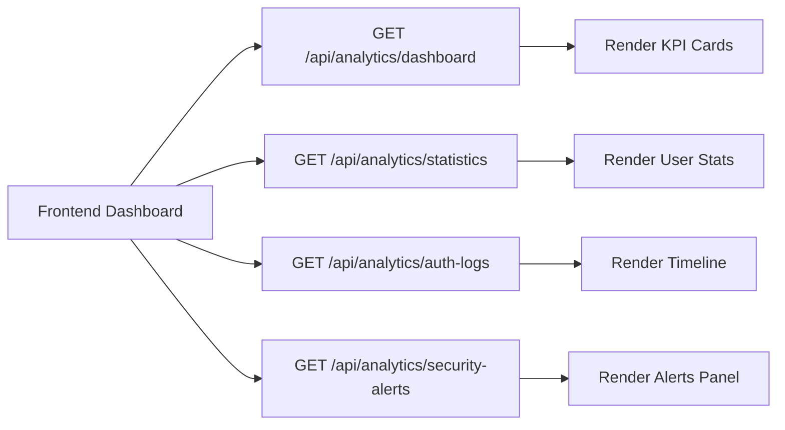

# 📊 Analytics & Monitoring

Menjelaskan cara menarik data keamanan & performa untuk dashboard frontend.

## Endpoint Utama
| Fungsi | Method | Endpoint | Query Penting | Output |
|--------|--------|----------|---------------|--------|
| List authentication logs | GET | /api/analytics/auth-logs/ | success, auth_method, date_from, date_to | Riwayat attempt |
| Detail authentication log | GET | /api/analytics/auth-logs/{id}/ | - | Detail satu log |
| List security alerts | GET | /api/analytics/security-alerts/ | severity, alert_type, resolved | Event keamanan |
| Detail security alert | GET | /api/analytics/security-alerts/{id}/ | - | Detail alert |
| Dashboard ringkas | GET | /api/analytics/dashboard/ | period=7_days|30_days|... | KPI ringkas |
| Statistik user | GET | /api/analytics/statistics/ | - | Aggregasi user |

Semua membutuhkan JWT kecuali dinyatakan lain (di sistem ini semua di atas memerlukan auth).

## 1. Dashboard (`/api/analytics/dashboard/`)
Contoh Response (diringkas):
```json
{
  "auth_stats": {
    "total_attempts": 42,
    "successful_attempts": 37,
    "avg_similarity": 0.91,
    "success_rate": 88.1
  },
  "alert_count": 2,
  "recent_activities": [
    {"timestamp":"2025-10-09T10:00:00Z", "success":true, "auth_method":"face"}
  ],
  "performance_metrics": {"avg_response_time": 0.42},
  "risk_analysis": {"avg_risk_score": 0.21, "high_risk_attempts": 1},
  "period": "30_days",
  "date_range": {"from": "2025-09-09", "to": "2025-10-09"}
}
```

## 2. Statistik User (`/api/analytics/statistics/`)
Contoh Response (diringkas):
```json
{
  "total_attempts": 42,
  "successful_attempts": 37,
  "failed_attempts": 5,
  "success_rate": 88.1,
  "face_enrolled": true,
  "avg_scores": {"similarity": 0.912, "liveness": 0.988, "quality": 0.801},
  "security_status": {"active_alerts": 1, "risk_level": "low"}
}
```

## 3. Authentication Log Filtering
GET /api/analytics/auth-logs/?success=true&auth_method=face&date_from=2025-10-01

## 4. Security Alerts Filtering
GET /api/analytics/security-alerts/?severity=high&resolved=false

## 5. Flow Konsumsi Data Dashboard


## 6. Normalisasi & Interpretasi
| Field | Interpretasi | Tips UI |
|-------|--------------|---------|
| avg_similarity | Kualitas matching historis | Bar / tag warna |
| avg_liveness | Stabilitas liveness | Badge hijau >0.9 |
| success_rate | Keberhasilan autentikasi | Donut chart |
| risk_level | Agregat risiko 7 hari | Warna: low=green medium=orange high=red |
| high_risk_attempts | Percobaan rawan | Tabel fokus |

## 7. Alert Severity Mapping
| severity | Warna |
|----------|-------|
| low | gray |
| medium | yellow |
| high | orange |
| critical | red |

## 8. Optimasi Frontend
- Cache dashboard 30–60s (debounce refresh manual).
- Lazy load detail logs (infinite scroll / paging).
- Gunakan skeleton UI saat fetch.

## 9. Security Consideration
- Jangan tampilkan IP pengguna lain (scope hanya self).
- Sanitasi failure_reason sebelum render.

---
Updated: (auto)
