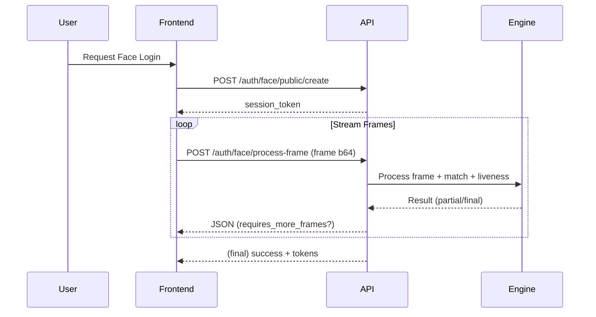

# 🔐 Authentication & Session API

Dokumen ini mencakup seluruh proses: registrasi, login password (JWT), face login (private & public), refresh token, dan struktur session.

## 1. Registrasi User
POST /api/auth/register/
Content-Type: application/json
Auth: None

Request Body (contoh):
```json
{
  "email": "user@example.com",
  "password": "StrongPass!123",
  "full_name": "Andi Pratama"
}
```
Response 201:
```json
{
  "message": "User registered successfully",
  "user_id": "uuid",
  "email": "user@example.com"
}
```

## 2. Login Password (JWT)
POST /api/auth/token/

Tambahkan optional `device_info` untuk tracking.
```json
{
  "email": "user@example.com",
  "password": "StrongPass!123",
  "device_info": {
    "device_id": "local-generated-uuid",
    "device_name": "Macbook-Chrome",
    "device_type": "web",
    "os": "macOS",
    "browser": "Chrome"
  }
}
```
Response 200:
```json
{
  "refresh": "<refresh_jwt>",
  "access": "<access_jwt>"
}
```

## 3. Refresh Token
POST /api/auth/token/refresh/
```json
{ "refresh": "<refresh_jwt>" }
```
Response 200:
```json
{ "access": "<new_access_jwt>" }
```

## 4. Mendapatkan / Update Profil
GET /api/auth/profile/ (Auth: Bearer)
Response 200 contoh (disederhanakan):
```json
{ "id": "uuid", "email": "user@example.com", "face_enrolled": true }
```

PUT /api/auth/profile/
```json
{ "full_name": "Nama Baru" }
```

## 5. Face Authentication (Private / Sudah Login)
### 5.1 Create Session
POST /api/auth/face/create/
Auth: Bearer
```json
{
  "session_type": "authentication", // atau "verification" (butuh target email)
  "email": null,
  "device_info": {"device_id": "abc-123", "device_name": "Macbook"}
}
```
Response 201:
```json
{
  "session_token": "uuid-session",
  "session_type": "authentication",
  "webrtc_config": { /* ICE servers dll */ }
}
```

### 5.2 Kirim Frame
Loop sampai sukses/final.
POST /api/auth/face/process-frame/
Auth: Bearer (kecuali public origin)
```json
{
  "session_token": "uuid-session",
  "frame_data": "data:image/jpeg;base64,/9j/..."
}
```
Kemungkinan Response (masih butuh frame):
```json
{
  "success": false,
  "requires_more_frames": true,
  "frames_processed": 4,
  "liveness_blinks": 1,
  "liveness_motion_events": 3,
  "liveness_score": 0.6
}
```
Sukses Final:
```json
{
  "success": true,
  "similarity_score": 0.92,
  "liveness_score": 1.0,
  "user": {"id": "uuid", "email": "user@example.com"},
  "session_finalized": true
}
```
Gagal Final:
```json
{
  "success": false,
  "error": "Authentication failed",
  "requires_new_session": true,
  "session_finalized": true
}
```

## 6. Public Face Login (Tanpa JWT Awal)
### 6.1 Create Session
POST /api/auth/face/public/create/
```json
{
  "session_type": "authentication",
  "email": "user@example.com",
  "device_info": {"device_id": "abc", "device_name": "Kiosk-1"}
}
```
Response 201 sama format (berisi `session_token`).

### 6.2 Kirim Frame (No Bearer Auth)
POST /api/auth/face/process-frame/
(Backend mendeteksi origin sesi `public_login`)

Jika match final:
```json
{
  "success": true,
  "access_token": "<jwt>",
  "refresh_token": "<jwt>",
  "user": {"id": "...", "email": "user@example.com"}
}
```

## 7. Status Sistem
GET /api/system/status/ (Auth: Bearer)
Menampilkan ringkasan engine & statistik.

## 8. Alur Flow Diagram


## 9. Error Handling Umum
| Kode | Kondisi | Catatan Frontend |
|------|---------|------------------|
| 400 | Session invalid / expired | Re-init session otomatis |
| 401 | Auth required | Redirect login / refresh token |
| 403 | Session owner mismatch | Abort & logout |
| 429 (future) | Rate limit | Tunda & retry bertahap |

## 10. Checklist Frontend
- [ ] Cache `device_id` di localStorage.
- [ ] Debounce pengiriman frame (misal tiap 200ms).
- [ ] Hentikan loop bila `session_finalized` true.
- [ ] Tampilkan progress liveness.
- [ ] Handle auto-recreate session jika `requires_new_session` true.

---
Updated: (auto)
