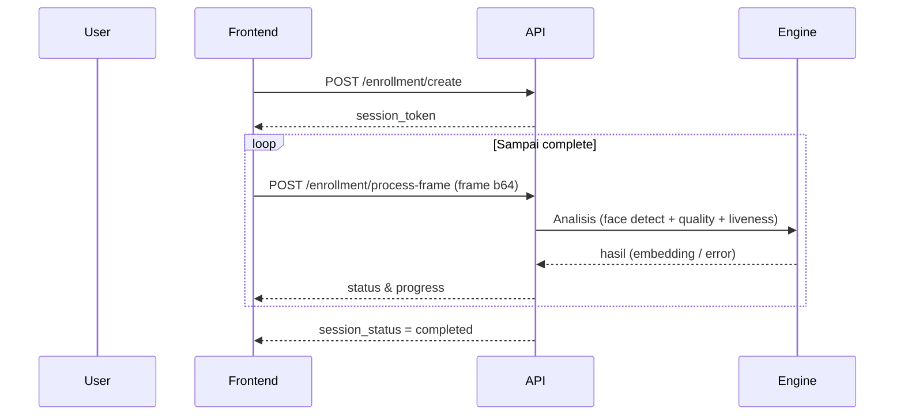

# 🧬 Face Enrollment & Liveness

Proses ini membangun embedding wajah user melalui serangkaian frame dengan verifikasi kualitas & liveness.

## Endpoint Ringkas
| Tujuan | Method | Endpoint | Auth | Keterangan |
|--------|--------|----------|------|------------|
| Create enrollment session | POST | /api/enrollment/create/ | Bearer | Dapatkan session_token |
| Kirim frame enrollment | POST | /api/enrollment/process-frame/ | Bearer | Kirim frame base64 berulang |
| List sesi (riwayat) | GET | /api/recognition/sessions/ | Bearer | Semua sesi enrollment user |
| Detail sesi | GET | /api/recognition/sessions/{id}/ | Bearer | Status & log |
| List embeddings | GET | /api/recognition/embeddings/ | Bearer | Embedding tersimpan |

## 1. Create Session
```json
POST /api/enrollment/create/
{
  "target_samples": 5 // (jika serializer support, jika tidak default server)
}
```
Response 201:
```json
{
  "session_token": "uuid",
  "target_samples": 5,
  "expires_at": "2025-10-09T10:00:00Z"
}
```

## 2. Kirim Frame
```json
POST /api/enrollment/process-frame/
{
  "session_token": "uuid",
  "frame_data": "data:image/jpeg;base64,/9j/..."
}
```
Response (progress):
```json
{
  "success": true,
  "session_status": "in_progress",
  "completed_samples": 2,
  "target_samples": 5,
  "quality_score": 0.78,
  "liveness_data": {"blinks_detected": 1},
  "obstacles": []
}
```
Response (completed):
```json
{
  "success": true,
  "session_status": "completed",
  "completed_samples": 5,
  "liveness_verified": true
}
```

## 3. Liveness Strategy
- Frame motion + blink detection.
- Server menormalkan skor liveness (0..1) dan menentukan finalisasi.
- Frontend cukup terus kirim frame hingga status `completed`.

## 4. Alur Diagram


## 5. Error Contoh
| Error | Penyebab | Mitigasi Frontend |
|-------|----------|-------------------|
| Invalid or expired enrollment session | Token kadaluarsa / salah | Re-create session |
| Could not decode image data | Base64 corrupt | Re-capture frame |
| Session expired | Melewati `expires_at` | Notifikasi user & ulang |

## 6. Best Practice Frontend
- Gunakan resolusi <= 480p, kompres JPEG quality ~0.7–0.8.
- Tunggu 150–250ms antar frame agar tidak flooding.
- Beri indikator progress: `completed_samples / target_samples`.
- Highlight jika kualitas rendah (threshold misal < 0.5) ajak user perbaiki pencahayaan.

---
Updated: (auto)
