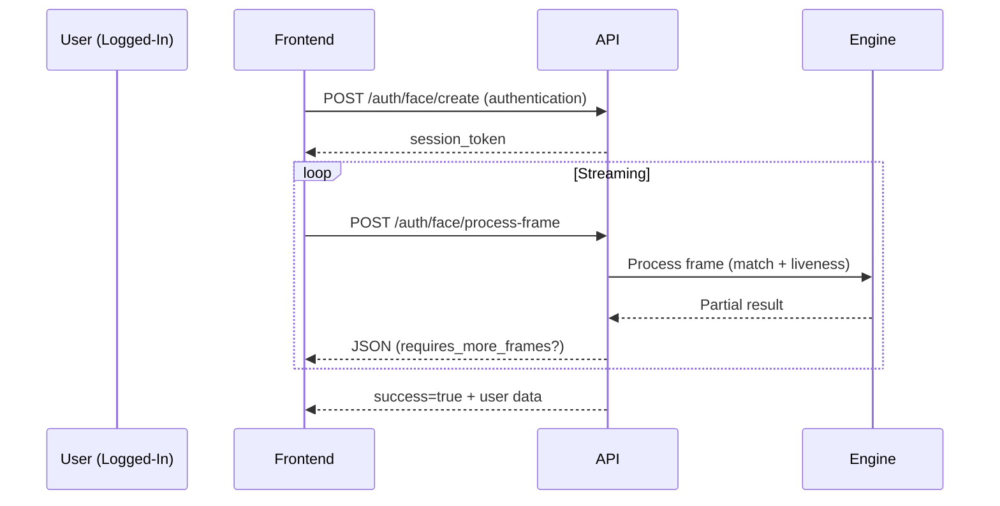
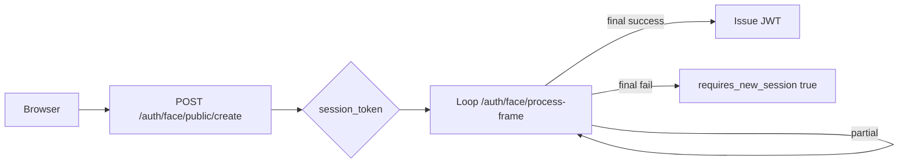

# 🆔 Identification & Verification

Terminologi:
- Identification: Mencocokkan wajah ke user yang sudah login (autentikasi diri sendiri).
- Verification: Memverifikasi wajah terhadap user tertentu (menggunakan email target) – misal approval kedua.

## Endpoint Digunakan
| Tujuan | Method | Endpoint | Auth | Keterangan |
|--------|--------|----------|------|------------|
| Create session (auth) | POST | /api/auth/face/create/ | Bearer | session_type=authentication |
| Create session (verification) | POST | /api/auth/face/create/ | Bearer | session_type=verification + email target |
| Public face login | POST | /api/auth/face/public/create/ | None | Hanya email + device_info |
| Kirim frame proses | POST | /api/auth/face/process-frame/ | Kondisional | Loop sampai final |
| List attempts | GET | /api/recognition/attempts/ | Bearer | Riwayat autentikasi |
| Detail attempt | GET | /api/recognition/attempts/{id}/ | Bearer | Rincian (skor dll) |

## 1. Create Verification Session (Contoh)
```json
POST /api/auth/face/create/
{
  "session_type": "verification",
  "email": "target_user@example.com",
  "device_info": {"device_id": "uuid"}
}
```
Response 201:
```json
{ "session_token": "uuid", "session_type": "verification" }
```

## 2. Proses Frame
Sama format dengan authentication biasa.

## 3. Response Field Penting
| Field | Arti |
|-------|------|
| success | True jika final sukses |
| requires_more_frames | True jika perlu lanjut streaming |
| similarity_score | Skor kecocokan (0..1) |
| liveness_score | Normalisasi liveness 0..1 |
| motion_verified | Gerakan cukup memenuhi liveness |
| requires_new_session | Harus create sesi baru (final fail) |
| session_finalized | Tidak akan menerima status baru |

## 4. Flow Diagram (Identification Private)


## 5. Flow Diagram (Public Face Login)


## 6. Integrasi Frontend (Pseudo)
```javascript
async function runFaceAuthPublic(email){
  const { session_token } = await api.post('/api/auth/face/public/create/', { session_type:'authentication', email, device_info });
  let finalized=false;
  while(!finalized){
    const frame = captureFrame();
    const res = await api.post('/api/auth/face/process-frame/', { session_token, frame_data: frame });
    if(res.data.session_finalized){
       finalized=true;
       if(res.data.success){ saveTokens(res.data.access_token,res.data.refresh_token); }
       else if(res.data.requires_new_session){ return runFaceAuthPublic(email); }
    }
  }
}
```

## 7. Logging & Audit
- Setiap attempt tercatat pada `AuthenticationAttempt` + `AuthenticationLog`.
- Atribut: similarity_score, liveness_score, obstacles, result kode (`success`, `failed_liveness`, dll).
- Dapat ditarik melalui analytics endpoints.

## 8. Error Patterns
| Skenario | Kode | Penanganan |
|----------|------|-----------|
| Session has ended | 400 | Buat sesi baru otomatis |
| Session owner mismatch | 403 | Abort & inform user |
| Invalid or expired session | 400 | Buat ulang session |
| Liveness belum terpenuhi | 200 + requires_more_frames | Teruskan streaming |

## 9. Best Practice
- Tampilkan indikator: frames_processed, liveness_blinks, liveness_motion.
- Otomatis hentikan setelah `session_finalized`.
- Retri *public login* otomatis max 2–3x sebelum fallback ke password.

---
Updated: (auto)
