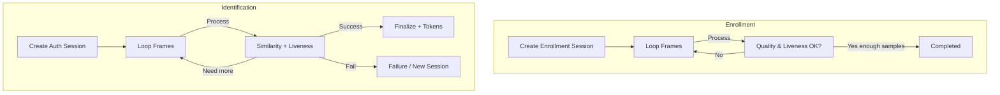

# 📡 WebRTC Implementation Guide (Enrollment & Identification)

Dokumen ini menjelaskan implementasi WebRTC untuk dua skenario utama:

1. Enrollment (pengambilan sampel wajah berkualitas + liveness)
2. Identification / Verification (autentikasi wajah real-time)

Walau sistem dapat bekerja hanya dengan pengiriman frame base64 via HTTP, WebRTC memberi keuntungan:

- Latency rendah (peer connection + adaptasi bitrate)
- Bisa real-time preview + quality feedback
- Memungkinkan ekstensi (arahkan user, overlay, dsb) di masa depan

---

## 🔑 Konsep Inti

| Komponen | Fungsi |
|----------|--------|
| StreamingSession (DB) | Menyimpan status sesi WebRTC (status, token, tipe) |
| session_token | Kunci unik yang menghubungkan signaling, streaming, dan frame HTTP |
| /api/webrtc/signal/ | Endpoint signaling (offer, answer, ice_candidate) |
| /api/enrollment/... | Endpoint proses frame enrollment batched |
| /api/auth/face/... | Endpoint proses frame authentication/verification |
| WebRTCSignal (DB) | Arsip pesan signaling historis |

---

## 🧱 Arsitektur Low-Level

```mermaid
flowchart LR
  A[Camera Stream] --> B[getUserMedia]
  B --> C[PeerConnection]
  C -->|ontrack| UI[Preview]
  C --> D[Canvas Extract Frame]
  D -->|interval 200ms| E[Base64 Encode]
  E -->|HTTP POST| F[Process Frame API]
  F --> G[Engine (Face + Liveness)]
  G --> F
  F -->|JSON| H[Progress State]
  H -->|update| UI
```

---

## 🛰️ Signaling Flow

```mermaid
sequenceDiagram
  participant FE as Frontend
  participant API as /api/webrtc/signal/
  participant DB as StreamingSession

  FE->>API: POST offer {session_token, signal_type:"offer", signal_data:{sdp}}
  API->>DB: Store offer + update status=connecting
  API-->>FE: {success:true, session_status:"connecting"}
  FE: Await answer (Polling / SSE extension future)
  FE->>API: POST ice_candidate {...}
```

Saat ini backend hanya menyimpan sinyal; frontend dapat memakai model "fire-and-forget" + polling GET `/api/streaming/signaling?session_token=...` (bisa ditambahkan di masa depan). Implementasi dasar cukup one-way (client → server) jika server tidak perlu mengirim remote stream.

---

## 🚀 Langkah Implementasi (Frontend)

### 1. Buat Session (Enrollment / Auth)

- Enrollment: `POST /api/enrollment/create/` (ambil `session_token`)
- Auth/Verification: `POST /api/auth/face/create/` atau public: `/api/auth/face/public/create/`

### 2. Konfigurasi Kamera

```javascript
const constraints = { video: { width: 640, height: 480, frameRate: { ideal: 30, max: 30 } }, audio: false };
const stream = await navigator.mediaDevices.getUserMedia(constraints);
videoEl.srcObject = stream;
```

### 3. (Opsional) Inisialisasi RTCPeerConnection

```javascript
const pc = new RTCPeerConnection({ iceServers: webrtc_config.iceServers || [] });
stream.getTracks().forEach(t => pc.addTrack(t, stream));

pc.onicecandidate = async (e) => {
  if (e.candidate) {
    await api.post('/api/webrtc/signal/', {
      session_token,
      signal_type: 'ice_candidate',
      signal_data: { candidate: e.candidate.candidate, sdpMid: e.candidate.sdpMid, sdpMLineIndex: e.candidate.sdpMLineIndex }
    });
  }
};

const offer = await pc.createOffer();
await pc.setLocalDescription(offer);
await api.post('/api/webrtc/signal/', {
  session_token,
  signal_type: 'offer',
  signal_data: { sdp: offer.sdp, type: offer.type }
});
```

> Server saat ini tidak mengembalikan *answer* otomatis—model ini digunakan hanya untuk memanfaatkan pipeline media & mempersiapkan evolusi arsitektur.

### 4. Ekstrak Frame Periodik

```javascript
const canvas = document.createElement('canvas');
canvas.width = 320; canvas.height = 240;
const ctx = canvas.getContext('2d');

let loop = true;
async function pumpFrames(){
  while(loop){
    ctx.drawImage(videoEl, 0, 0, canvas.width, canvas.height);
    const frameData = canvas.toDataURL('image/jpeg', 0.75);
    await sendFrame(frameData);
    await new Promise(r => setTimeout(r, 220)); //  ~4-5 fps
  }
}
```

### 5. Kirim Frame Enrollment

```javascript
async function sendEnrollmentFrame(frameData){
  const { data } = await api.post('/api/enrollment/process-frame/', { session_token, frame_data: frameData });
  if(data.session_status === 'completed'){ loop = false; }
  // Update UI progress, quality, liveness
}
```

### 6. Kirim Frame Authentication / Verification

```javascript
async function sendAuthFrame(frameData){
  const { data } = await api.post('/api/auth/face/process-frame/', { session_token, frame_data: frameData });
  if(data.requires_more_frames) return; // lanjut loop
  if(data.session_finalized){
     loop = false;
     if(data.success){
       if(data.access_token) saveTokens(data.access_token, data.refresh_token);
       // Navigate dashboard
     } else if(data.requires_new_session){ restartSession(); }
  }
}
```

### 7. Quality & Adaptive Strategy

| Situasi | Aksi Frontend |
|---------|---------------|
| quality_score < 0.5 | Tampilkan hint: perbaiki pencahayaan / fokus kamera |
| liveness_score < 0.5 setelah banyak frame | Minta user kedip / gerak kepala ringan |
| obstacles berisi "multiple_faces" | Minta user sendiri di frame |
| requires_new_session true | Stop loop → create session baru otomatis |

### 8. Penyimpanan State

Simpan `session_token` di memori (jangan localStorage). Jika tab refresh → user ulang proses.

### 9. Error Handling Pola

| Kode | Respons | Penanganan |
|------|---------|------------|
| 400 | Invalid / expired session | Buat ulang session & ulangi loop |
| 403 | Session owner mismatch | Abort + logout (kemungkinan race) |
| 500 | Internal error | Tunda 1–2 detik lalu tawarkan retry |

### 10. Low-Level Data Model Referensi

```json
// StreamingSession (subset)
{
  "session_token": "session_xxx",
  "session_type": "authentication",
  "status": "processing",
  "session_data": {
    "frames_processed": 12,
    "liveness_blinks": 1,
    "motion_verified": true,
    "last_similarity": 0.82,
    "latest_bbox": [x,y,w,h]
  }
}
```

### 11. Keamanan & Privasi

- Jangan kirim audio (audio:false) kecuali dibutuhkan.
- Turunkan resolusi sebelum encode (maks 640x480 → 320x240 untuk kirim).
- Hapus referensi `canvas` setelah selesai (`canvas.width = canvas.height = 0`).
- Hindari memori leak: hentikan track kamera `stream.getTracks().forEach(t => t.stop())` saat selesai.

### 12. Roadmap Ekstensi (Opsional)

| Fitur | Deskripsi |
|-------|-----------|
| Answer Generation | Backend kirim jawaban SDP untuk full P2P scenario |
| ICE Retrieval API | GET signaling untuk multi-perangkat / remote monitor |
| WebSocket Signaling | Mengurangi overhead polling |
| Adaptive Bitrate Feedback | Server mengirim rekomendasi resolusi baru |

---

## 🔄 Flow Enrollment vs Identification (Ringkas)



### 13. Vue Composable Skeleton (Bonus)

```javascript
import { ref } from 'vue';
export function useFaceSession(api){
  const state = ref({ progress:0, liveness:0, similarity:0, status:'idle' });
  let sessionToken=null, loop=false, videoEl, mode='auth';

  async function init(kind){
    mode = kind; state.value.status='starting';
    const ep = kind==='enroll'? '/api/enrollment/create/' : '/api/auth/face/create/';
    const { data } = await api.post(ep, { session_type: kind==='enroll'?'enrollment':'authentication', device_info:{ device_id: localStorage.getItem('device_id')} });
    sessionToken = data.session_token; loop=true; await startCamera(); pump();
  }
  async function startCamera(){
    const stream = await navigator.mediaDevices.getUserMedia({ video:true, audio:false });
    videoEl.srcObject = stream; await videoEl.play();
  }
  async function pump(){
    const canvas=document.createElement('canvas'); canvas.width=320; canvas.height=240;
    const ctx=canvas.getContext('2d');
    while(loop){
      ctx.drawImage(videoEl,0,0,canvas.width,canvas.height);
      const frame=canvas.toDataURL('image/jpeg',0.75);
      await sendFrame(frame);
      await new Promise(r=>setTimeout(r,220));
    }
  }
  async function sendFrame(frame){
    const ep = mode==='enroll'? '/api/enrollment/process-frame/' : '/api/auth/face/process-frame/';
    const { data } = await api.post(ep,{ session_token: sessionToken, frame_data: frame });
    state.value = { ...state.value, progress: data.completed_samples || data.frames_processed, liveness: data.liveness_score, similarity: data.similarity_score || 0, status: data.session_status || (data.session_finalized?'final':'processing') };
    if(data.requires_more_frames) return;
    if(data.session_finalized || data.session_status==='completed'){ loop=false; }
    if(data.requires_new_session){ loop=false; /* optionally restart */ }
  }
  function stop(){ loop=false; const tracks=videoEl?.srcObject?.getTracks?.(); tracks&&tracks.forEach(t=>t.stop()); }
  return { state, init, stop, attachVideo: el => videoEl=el };
}
```

---

Updated: (auto)
 
## 🔧 Endpoint Tambahan (WebRTC Session Creation)

| Endpoint | Method | Deskripsi | Auth |
|----------|--------|-----------|------|
| /api/enrollment/webrtc/create/ | POST | Buat streaming session enrollment (WebSocket) | Bearer |
| /api/auth/face/webrtc/create/ | POST | Buat streaming session auth/verification (WebSocket) | Bearer |
| /api/auth/face/webrtc/public/create/ | POST | WebRTC public face login (tanpa JWT awal) | None |
| ws://host/ws/face-recognition/{session_token}/ | WS | Kirim frame_data / terima frame_result | Bearer (cookie / header session) |

Body (auth webrtc create):
```json
{ "session_type": "authentication", "email": null, "device_info": {"device_id": "abc"} }
```

### Event Types (WebSocket)
| type | Deskripsi |
|------|-----------|
| connection_established | Koneksi siap, berisi session_token & session_type |
| frame_result | Hasil proses satu frame (progress, quality, liveness, embedding_saved) |
| session_final | Sesi selesai (completed / failed) dengan result final + optional tokens |
| webrtc_signal | Pesan signaling diteruskan peer lain (jika multi‑peer) |
| error | Error terstruktur `{error: message}` |

#### session_final Payload (Contoh)

```json
{
  "type": "session_final",
  "result": {"success": true, "similarity_score": 0.91, "quality_score": 0.78},
  "frames_processed": 54,
  "reason": "authenticated",
  "access": "<jwt access>",
  "refresh": "<jwt refresh>"
}
```

Field access & refresh hanya muncul untuk sesi public login (`origin: public_login / webrtc_public_auth`).

#### Possible reason values

| reason | Situasi |
|--------|---------|
| authenticated | Berhasil autentikasi wajah |
| frame_budget_exceeded | Frame > AUTH_FRAME_BUDGET tanpa success |
| low_quality_abort | Terhenti karena terlalu banyak frame kualitas rendah berturut-turut |
| manual_stop | Pengguna menghentikan sesi (future) |
| error | Kesalahan fatal internal |

#### Low Quality Abort Conditions

- Threshold kualitas: `< FAIL_LOW_QUALITY_THRESHOLD` (default 0.30)
- Konsekutif: `>= MAX_LOW_QUALITY_CONSECUTIVE` (default 25)
- Server mengirim session_final dengan `reason: low_quality_abort`

Frontend dapat menampilkan hint: "Perbaiki pencahayaan / fokus kamera" dan menawarkan tombol restart.

